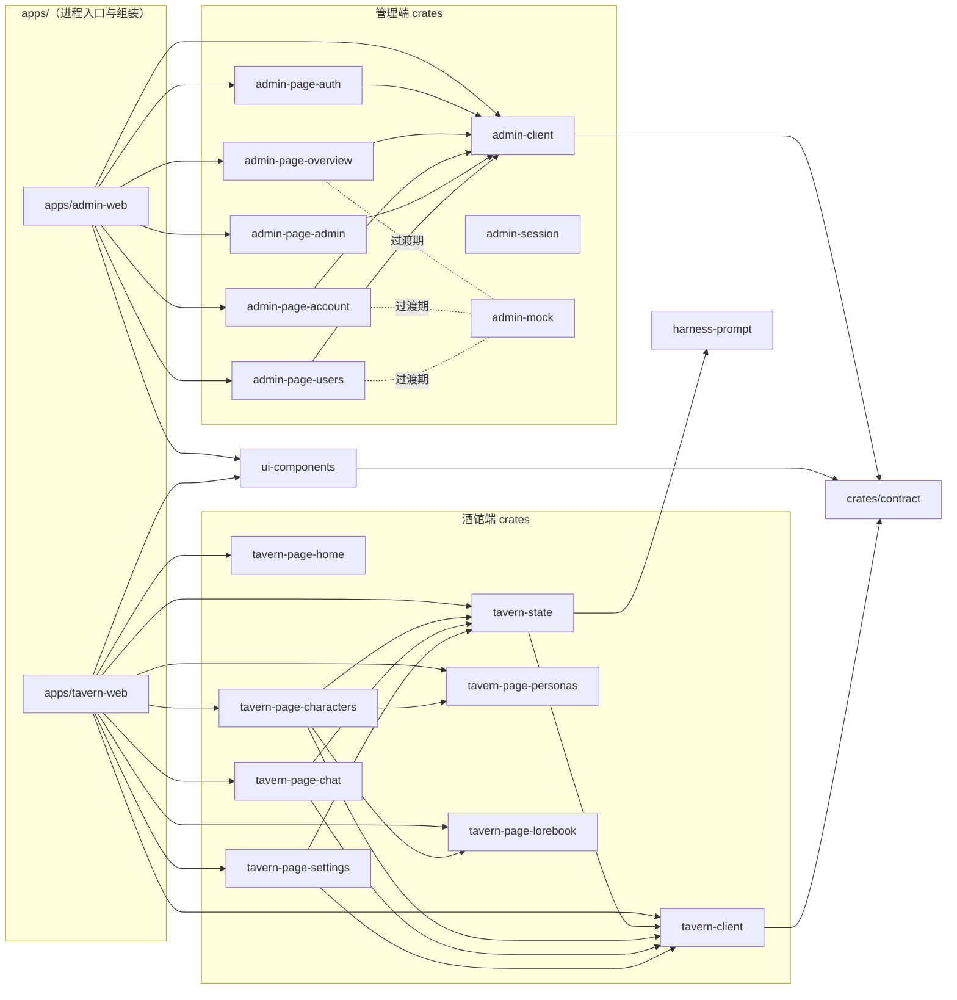

# crates/web — 前端大域心智模型

> 阅读对象：维护者与任何进场的 agent / 会话。本文是 web 域的全局地图；各子域的 MVP 计划与文件级任务在 [admin.md](./admin.md) 和 [tavern.md](./tavern.md)；外部竞品借鉴调查在仓库根 `todo/web-ui-reference/`（gitignored，不入库）。
> 基线：`ab2315a`（2026-09-11 重写于 chore/web-readme）。依赖结论经过三源交叉校验：Cargo.toml path 声明、codegraph IMPORTS_FROM 边、grep 实际 `use` 语句。

## 1. 全景

两大子域 + 一层跨端共享件，由 `apps/` 下两个可独立部署的 wasm 应用组装。跨端数据交互只走 `crates/contract` DTO。



## 2. crate 清单

### 管理端（消费 `/admin/*` API）

```
crates/web/
├── admin-client            管理 API 客户端
├── admin-session           登录 / 刷新 / 全局会话
├── admin-mock              页面开发 mock 数据
├── admin-page-auth         认证页
├── admin-page-overview     总览与排行榜
├── admin-page-account      个人中心
├── admin-page-admin        管理操作
└── admin-page-users        用户管理
```

- **admin-client**（内部依赖：contract；src：lib.rs / manage_auth_token.rs / setup_client.rs）
  - 管理 API 客户端：Bearer 注入、`Envelope<T>` 解码、401 时调用 refresher
  - 导出 `ApiClient`（setup_client.rs）、`AuthState` / `Refresher` / `TokenFuture`（manage_auth_token.rs）
  - 现状：稳定
- **admin-session**（内部依赖：client；src：lib.rs / login.rs / manage_session.rs / refresh_token.rs）
  - 登录、2FA 验证（`verify_2fa`）、token 刷新、全局会话（`SESSION` GlobalSignal：init / clear_session / logout）
  - 现状：稳定
- **admin-mock**（无内部依赖；src：lib.rs / models.rs / account.rs / overview.rs / users.rs）
  - 页面开发的 mock 数据；**overview / account / users 三个页面仍在用**（grep `mock::` 核实），真实 API 接完后移除引用（见 admin.md）
- **admin-page-auth**（内部依赖：client, contract, ui；src：lib.rs / api.rs / form.rs / state.rs / view.rs）
  - 认证页：登录、注册、二次验证、密码重置；现状：真实 API
- **admin-page-overview**（内部依赖：client, contract, mock；src：lib.rs / api.rs / overview.rs / models.rs / leaderboard/ / health.rs）
  - 总览：请求量/成功率/成本统计卡、模型分布、用户·模型·渠道日排行；现状：**部分 mock**
  - 注意：本 crate **未用 ui-components**（全域唯一不用共享组件的页面 crate），待统一
- **admin-page-account**（内部依赖：client, contract, mock, ui；src：lib.rs / api.rs / keys.rs / usage_logs.rs / usage_support.rs / sessions.rs / settings.rs / rewards.rs）
  - 个人中心：API Key 列表增删、用量日志、会话、奖励；现状：**部分 mock**
- **admin-page-admin**（内部依赖：client, contract, ui；src：lib.rs / api.rs / entities.rs / channels.rs / pages.rs / groups.rs / redemptions.rs / network.rs / system.rs / state.rs / aliases.rs）
  - 管理操作：渠道 CRUD（凭据掩码、测试按钮）、模型+分组到渠道的路由映射、令牌、分组倍率、兑换码、网络、系统；现状：真实 API
- **admin-page-users**（内部依赖：client, contract, mock, ui；src：lib.rs / api.rs / data.rs / panel.rs）
  - 用户管理：列表与操作；现状：**部分 mock**

### 酒馆端（消费 `/tavern/*` API，含 SSE 流式）

```
crates/web/
├── tavern-client           /tavern/* 请求 + SSE 解析
├── tavern-state            角色/聊天/消息状态
├── tavern-page-home        首页
├── tavern-page-characters  角色列表/编辑（内嵌 personas + lorebook）
├── tavern-page-chat        聊天与流式生成
├── tavern-page-personas    用户人设面板
├── tavern-page-lorebook    世界书面板
└── tavern-page-settings    连接/模型/采样设置
```

- **tavern-client**（内部依赖：contract；src：lib.rs 单文件）
  - `/tavern/*` 全部请求 + `generate` SSE 分帧解析（`data:` 行、`[DONE]`、多段 delta 累积）；DTO：`Character` / `CharacterSummary` / `Message`
- **tavern-state**（内部依赖：tavern-client, **harness-prompt**；src：lib.rs）
  - `TavernState`（当前角色/聊天/消息）、`GenerationState`（生成中/累积文本/中止）、`append_delta`、`finish_turn`、`abort`
  - **前端唯一伸进 harness 域的依赖**（聊天提示词构建）
- **tavern-page-home**（内部依赖：仅 dioxus；src：lib.rs）——首页；全域唯一不用 ui-components 的 tavern 页面
- **tavern-page-characters**（内部依赖：tavern-client, tavern-state, ui, tavern-page-personas, tavern-page-lorebook；src：lib.rs）
  - 角色列表/新建/编辑；lib.rs:762 起**内嵌 PersonasPage 与 LorebookPage**（跨 page crate 组合的唯一例外）
- **tavern-page-chat**（内部依赖：tavern-client, tavern-state, ui；src：lib.rs）
  - 聊天、流式生成、swipe 切换、单条编辑删除、历史
- **tavern-page-personas**（内部依赖：ui；src：lib.rs）——角色扮演用户人设面板
- **tavern-page-lorebook**（内部依赖：ui；src：lib.rs）——世界书面板
- **tavern-page-settings**（内部依赖：tavern-client, tavern-state, ui；src：lib.rs）
  - 连接/模型/密钥/采样设置、连通测试

### 跨端共享

- **ui-components**（内部依赖：contract；src：lib.rs / card.rs / bubble.rs / dialog.rs / feedback.rs / form.rs / segmented.rs / scroll_spy.rs / auth_modal.rs / session.rs / components/{badge,button,card,input}）
  - 跨端通用组件层；**只依赖 contract，不依赖任何 client/page**
  - `session.rs`：localStorage 令牌存取与 auth 请求（`get_cached_token` / `refresh_access_token` / `clear_cached_session`），storage key：`ferrite_access_token` / `ferrite_current_user` / `ferrite_refresh_token`

## 3. 依赖规则与改名映射

- **组装只发生在 `apps/*`**：page crate 互相不感知（唯一例外：characters 内嵌 personas/lorebook 面板）。
- 页面 → `client` + `contract`（DTO 唯一来源，域间禁止私有依赖）。
- `ui-components` 是最底层共享件：不反向依赖任何页面/客户端。
- `tavern-state → harness-prompt` 是前端唯一越界到 harness 域的依赖。

Cargo.toml 里的改名依赖（读代码时按 key 认依赖，浅解析 Cargo.toml 会漏）：

- `client` → `admin-client`
- `mock` → `admin-mock`
- `ui` → `ui-components`
- `tavern_client` / `tavern_state` → `tavern-client` / `tavern-state`
- `page-auth` / `page-account` / `page-overview` / `page-admin` / `page-users` → `admin-page-*`

## 4. 应用组装与样式

- **apps/admin-web**：`main.rs` 挂 `tailwind.out.css` + `dx-components-theme.css`；`init_auth()` 在首帧前注册 401 静默刷新（access 15min 过期 → refresher 换新 → 失败清 storage 跳登录）。`app.rs` 的 `RootApp` 按 URL hash 分支：`#retro` 拓扑页（retro.rs）/ `#auth` `#signup` `#login` 独立认证页 / 其余走 console。
- **apps/tavern-web**：`main.rs` 只挂 `tailwind.out.css`（**不挂 dx-components-theme**，两应用样式基座不完全一致，统一时注意）。
- Tailwind v4.3.2 CLI（`@tailwindcss/cli`）：`assets/tailwind.entry.css` 里 `@import "tailwindcss"` + 显式把 `.rs` 源加入扫描（v4 CLI 默认不扫 rust 文件）。

## 5. 前端约定（开工必读）

- **wasm32 硬约束**：`cargo check --target wasm32-unknown-unknown -p <crate>` 必须过（本地只 check，测试上 CI）。
- 测试放同层 `tests/`，`src/` 内禁止 `#[cfg(test)]`。
- **UI 验证契约**：交互元素加 `data-testid`（取 name 属性值）、容器加 role + aria-label；每页一份 `specs/ui/<page>.yaml`；PR smoke 用 `tab.ariaSnapshot()`。详见 `.agent/skills/ui-validation/SKILL.md`。
- **列表 UI 一律卡片面板 + flex**：`rounded-xl border bg-card divide-y` 容器 + `flex flex-wrap` 行（桌面指标 `hidden sm:flex`、移动 `sm:hidden` 二行 grid），**禁用 `<table>`**——手机端不遮挡、桌面高密度。细节见 `todo/web-ui-reference/shadcn-dashboard-01.md`。
- Dioxus 已知坑：嵌套 `rsx!`（if/for 内）会报 "expected identifier"，用原始元素语法；`onclick: move |_| f.call(sid)` 会 move 出 FnMut，写 `sid.clone()`；dx serve hotreload 对结构性 DOM 改动不可靠，需重启。
- 公共 API 写 rust doc（`///`），模块头 `//!` 说职责。

## 6. 开发流程指针

- worktree：`.wt/<name>` ↔ 分支尾段同名（`.wt/web-readme` ↔ `chore/web-readme`）；仓库根只读。创建 worktree 的防嵌套规则见根 `AGENTS.md`。
- 域独占：接手 `crates/web/<crate>` 即独占该 crate；跨 crate/跨域需在 PR 报备。
- 各子域 MVP 顺序、文件级任务清单、验收命令：**admin.md / tavern.md 是 source of truth**，本 README 只做地图。
- 外部借鉴调查（new-api、shadcn dashboard-01）在根 `todo/web-ui-reference/`（gitignored，仅仓库根工作副本可见，worktree 内用绝对路径 `/home/hathaway/projects/ferrite/todo/web-ui-reference/` 访问）。

## 7. 变更记录

- 2026-09-11：chore/web-readme 初版，重写为全域心智模型；依赖图经 Cargo.toml / codegraph / grep 三源校验。
- 2026-09-11：crate 清单与改名映射由表格改为树+列表（agent 阅读友好）。
