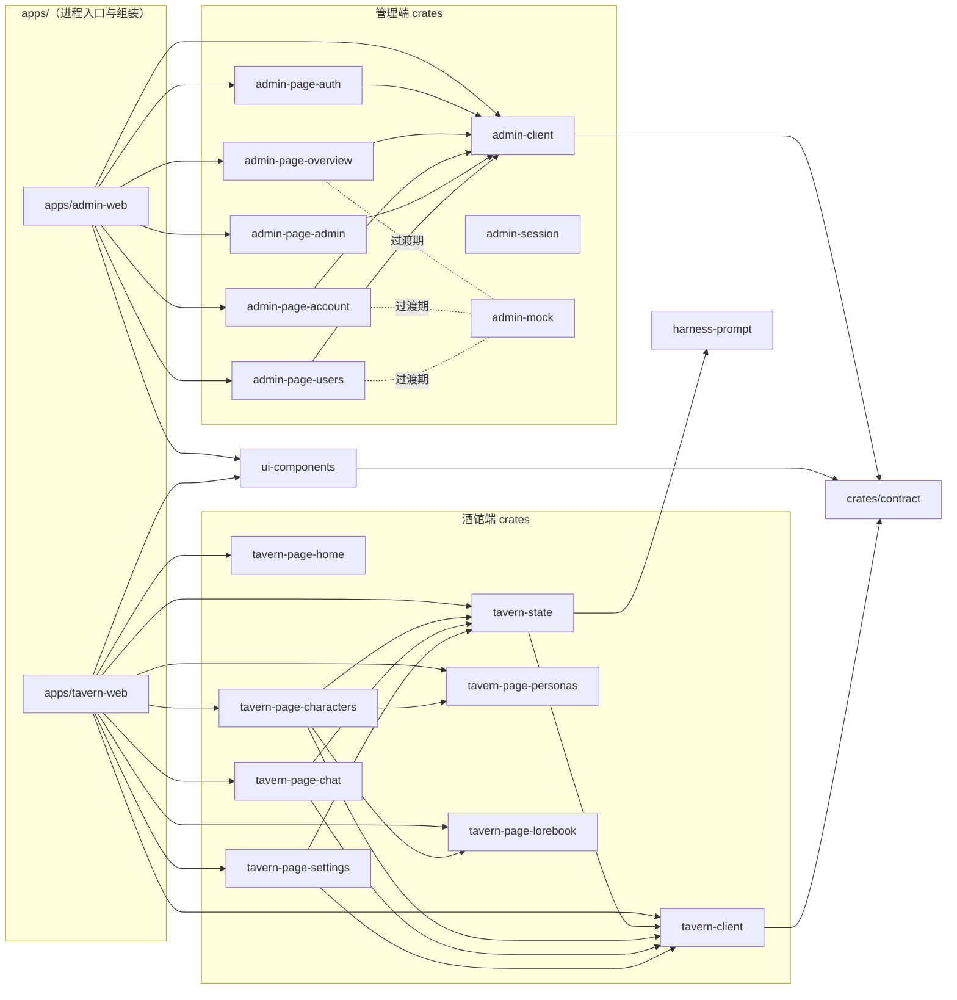

# crates/web — 前端大域心智模型

> 阅读对象：维护者与任何进场的 agent / 会话。本文是 web 域的全局地图；各子域的 MVP 计划与文件级任务在 [admin.md](./admin.md) 和 [tavern.md](./tavern.md)；外部竞品借鉴调查在仓库根 `todo/web-ui-reference/`（gitignored，不入库）。
> 基线：`ab2315a`（2026-09-11 重写于 docs/web-readme）。依赖结论经过三源交叉校验：Cargo.toml path 声明、codegraph IMPORTS_FROM 边、grep 实际 `use` 语句。

## 1. 全景

两大子域 + 一层跨端共享件，由 `apps/` 下两个可独立部署的 wasm 应用组装。跨端数据交互只走 `crates/contract` DTO。

## 2. crate 清单

依赖一栏写的是 Cargo.toml 里的 **dep key**（改名映射见 §3）。

### 管理端（消费 `/admin/*` API）

| crate | 职责 | 内部依赖 | 现状（2026-09-11） |
|---|---|---|---|
| `admin-client` | 管理 API 客户端：Bearer 注入、`Envelope<T>` 解码、401 触发 refresher | contract | 稳定 |
| `admin-session` | login / 2FA / refresh / 全局会话（`SESSION` GlobalSignal） | client, dioxus | 稳定 |
| `admin-mock` | 页面开发的 mock 数据（models/account/overview/users） | — | 接完真实 API 后移除引用 |
| `admin-page-auth` | 认证页：登录、注册、二次验证、密码重置 | client, contract, ui | 真实 API |
| `admin-page-overview` | 总览：请求量/成功率/成本统计卡、模型分布、用户·模型·渠道日排行 | client, contract, mock, chrono | **部分 mock** |
| `admin-page-account` | 个人中心：API Key、用量日志、会话、奖励 | client, contract, mock, ui, chrono | **部分 mock** |
| `admin-page-admin` | 管理操作：渠道 CRUD、路由映射、令牌、分组倍率、兑换码、网络、系统 | client, contract, ui, hex | 真实 API |
| `admin-page-users` | 用户管理：列表与操作 | client, contract, mock, ui, chrono | **部分 mock** |

### 酒馆端（消费 `/tavern/*` API，含 SSE 流式）

| crate | 职责 | 内部依赖 |
|---|---|---|
| `tavern-client` | `/tavern/*` 请求 + `generate` SSE 分帧解析（`data:` 行、`[DONE]`） | contract, gloo-net, http, serde, thiserror |
| `tavern-state` | 当前角色/聊天/消息、生成状态与中止、delta 追加 | tavern-client, **harness-prompt**, dioxus |
| `tavern-page-home` | 首页 | dioxus |
| `tavern-page-characters` | 角色列表/新建/编辑；**内嵌 PersonasPage 与 LorebookPage**（lib.rs:762） | tavern-client, tavern-state, ui, tavern-page-personas, tavern-page-lorebook |
| `tavern-page-chat` | 聊天、流式生成、swipe、消息编辑删除、历史 | tavern-client, tavern-state, ui |
| `tavern-page-personas` | 角色扮演用户人设面板 | dioxus, ui |
| `tavern-page-lorebook` | 世界书面板 | dioxus, ui |
| `tavern-page-settings` | 连接/模型/密钥/采样设置、连通测试 | tavern-client, tavern-state, ui |

### 跨端共享

| crate | 职责 |
|---|---|
| `ui-components` | 跨端通用组件（card/button/badge/input/dialog/feedback/form/segmented/scroll_spy/bubble/auth_modal）+ `session.rs`（localStorage 令牌存取与 auth 请求，`get_cached_token` / `refresh_access_token` / `clear_cached_session`）。只依赖 contract，**不依赖任何 client/page** |

## 3. 依赖规则与改名映射

- **组装只发生在 `apps/*`**：page crate 互相不感知（唯一例外：characters 内嵌 personas/lorebook 面板）。
- 页面 → `client` + `contract`（DTO 唯一来源，域间禁止私有依赖）。
- `ui-components` 是最底层共享件：不反向依赖任何页面/客户端。
- `tavern-state → harness-prompt` 是前端唯一伸进 harness 域的依赖（聊天提示词构建）。

Cargo.toml 中的改名（读代码时按 key 认依赖）：

| dep key | 真实包 |
|---|---|
| `client` | `admin-client` |
| `mock` | `admin-mock` |
| `ui` | `ui-components` |
| `tavern_client` / `tavern_state` | `tavern-client` / `tavern-state` |
| `page-auth` / `page-account` / `page-overview` / `page-admin` / `page-users` | `admin-page-*` |

## 4. 应用组装与样式

- **apps/admin-web**：`main.rs` 挂 `tailwind.out.css` + `dx-components-theme.css`；`init_auth()` 在首帧前注册 401 静默刷新（access 15min 过期 → refresher 换新 → 失败清 storage 跳登录）。`app.rs` 的 `RootApp` 按 URL hash 分支：`#retro` 拓扑页（retro.rs）/ `#auth` `#signup` `#login` 独立认证页 / 其余走 console。
- **apps/tavern-web**：`main.rs` 只挂 `tailwind.out.css`（**不挂 dx-components-theme**，两应用样式基座不完全一致，统一时注意）。
- Tailwind v4.3.2 CLI（`@tailwindcss/cli`）：`assets/tailwind.entry.css` 里 `@import "tailwindcss"` + 显式把 `.rs` 源加入扫描（v4 CLI 默认不扫 rust 文件）。

## 5. 前端约定（开工必读）

- **wasm32 硬约束**：`cargo check --target wasm32-unknown-unknown -p <crate>` 必须过（本地只 check，测试上 CI）。
- 测试放同层 `tests/`，`src/` 内禁止 `#[cfg(test)]`。
- **UI 验证契约**：交互元素加 `data-testid`（取 name 属性值）、容器加 role + aria-label；每页一份 `specs/ui/<page>.yaml`；PR smoke 用 `tab.ariaSnapshot()`。详见 `.agent/skills/ui-validation/SKILL.md`。
- **列表 UI 一律卡片面板 + flex**：`rounded-xl border bg-card divide-y` 容器 + `flex flex-wrap` 行（桌面指标 `hidden sm:flex`、移动 `sm:hidden` 二行 grid），**禁用 `<table>`**——手机端不遮挡、桌面高密度。细节见 `todo/web-ui-reference/shadcn-dashboard-01.md`。
- Dioxus 已知坑：嵌套 `rsx!`（if/for 内）会报 "expected identifier"，用原始元素语法；`onclick: move |_| f.call(sid)` 会 move 出 FnMut，写 `sid.clone()`；dx serve hotreload 对结构性 DOM 改动不可靠，需重启。
- 公共 API 写 rust doc（`///`），模块头 `//!` 说职责。

## 6. 开发流程指针

- worktree：`.wt/<name>` ↔ 分支尾段同名（`.wt/web-readme` ↔ `docs/web-readme`）；仓库根只读。创建 worktree 的防嵌套规则见根 `AGENTS.md`。
- 域独占：接手 `crates/web/<crate>` 即独占该 crate；跨 crate/跨域需在 PR 报备。
- 各子域 MVP 顺序、文件级任务清单、验收命令：**admin.md / tavern.md 是 source of truth**，本 README 只做地图。
- 外部借鉴调查（new-api、shadcn dashboard-01）在根 `todo/web-ui-reference/`（gitignored，仅仓库根工作副本可见，worktree 内用绝对路径 `/home/hathaway/projects/ferrite/todo/web-ui-reference/` 访问）。

## 7. 变更记录

- 2026-09-11：docs/web-readme 初版。重写为全域心智模型；依赖图经 Cargo.toml / codegraph / grep 三源校验。
