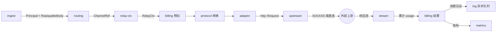
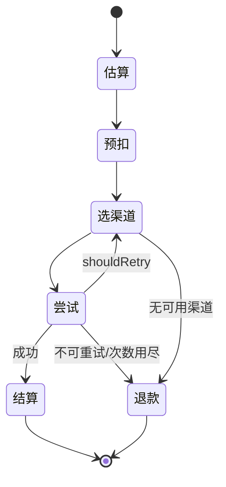

# gateway — AI 推理网关

- 二进制：`gateway`
- 技术栈：Rust / axum / reqwest / tokio
- 监听：`:8080`（HTTP，TLS 由 nginx 卸载）
- 副本：N，**主要扩容对象**
- 承接：66 条路由（`relay-router.go` 55 + `video-router.go` 11）
- Go 来源：`relay/`（42883 行）+ `controller/relay.go` + `controller/video_proxy.go` + `controller/playground.go` + `modules/relaykit`（15316 行）+ 计费相关 `service/`
- 依赖：redis（**多副本必需**）、postgres（计费写）、log-db（日志写）、egress（可选出网）
- **不做**：管理 API、登录会话、支付、DB 迁移、定时任务

---

## 1. 内部功能

### 1.1 ingest — 请求接入

- token 鉴权 — `middleware/auth.go:408` `ValidateUserToken` → `model/token.go` `GetTokenByKey`（Redis 优先，DB 兜底）
- 用户快照读取 — `model.GetUserCache`（Redis HSET）
- token IP 白名单 — token 上的 `allow_ips` 字段，`common.IsIpInCIDRList`
- 模型名提取 — `middleware/distributor.go:192` `getModelFromRequest` / `:209` `getModelFromJSONBody`（gjson 取字段，不反序列化整个 body）
- 请求体捕获与重放 — `common/body_storage.go:286` `CreateBodyStorage`；小体走内存（`:52` `newMemoryStorage`），大体落盘（`:127` `newDiskStorage`）
- 请求体大小限制 — `middleware/request_body_limit.go`
- 请求体清理 — `middleware/body_cleanup.go` `BodyStorageCleanup`
- 解压 — `middleware/gzip.go` `DecompressRequestMiddleware`
- 模型级限流 — `middleware/model-rate-limit.go`（Redis Lua，兜底进程内 map）
- 路由级限流 — `middleware/rate-limit.go:15` `redisRateLimitNamespace = "rateLimit:v2"` + `:22` 固定窗口 Lua
- 系统负载熔断 — `middleware/performance.go` `SystemPerformanceCheck`，读 `common.GetSystemStatus()`
- 请求 ID — `middleware/request-id.go`
- CORS — `middleware/cors.go`
- 统计 — `middleware/stats.go` `StatsMiddleware`
- 特殊格式前置转换 — `middleware/jimeng_adapter.go` `JimengRequestConvert`、`middleware/kling_adapter.go` `KlingRequestConvert`

### 1.2 routing — 渠道选择

- 主选择 — `service/channel_select.go:45` `CacheGetRandomSatisfiedChannel`（auto-group 组内优先级 + 跨组重试）
- 缓存读 — `model/channel_cache.go:19` `group2model2channels`、`channelsIDM`
- 纯 SQL 回退 — `model/ability.go:108` `GetChannel`（`MemoryCacheEnabled=false` 时启用；**Rust 侧先实现这条**）
- 渠道可用性判断 — `model/channel_satisfy.go` `IsChannelEnabledForGroupModel`
- 粘性亲和读 — `service/channel_affinity.go:550` `GetPreferredChannelByAffinity`
- 粘性亲和写 — `service/channel_affinity.go:713` `RecordChannelAffinity`（成功后才写）
- 亲和缓存 — `service/channel_affinity.go:93` `cachex.HybridCache[int]`，命名空间 `new-api:channel_affinity:v1`（`:29`）
- 亲和覆盖模板 — `service/channel_affinity.go` `ApplyChannelAffinityOverrideTemplate`
- 多 key 渠道轮询 — `model/channel.go:242-283` `GetNextEnabledKey` + `:614` `channelPollingLocks`
- 渠道上下文装载 — `middleware/distributor.go:444` `SetupContextForSelectedChannel`
- 路径能力匹配 — `middleware/distributor.go:176` `channelSupportsRequestPath`
- 分组能力 — `service/group.go`（8 个导出符号：`GetUserUsableGroups`、`GetRequestAutoGroups`、`GetUserGroupRatio` 等）

### 1.3 protocol — 格式转换（纯函数）

- 14 种格式 — `modules/relaykit/types/relay_format.go:6-19`：
  `openai`、`claude`、`gemini`、`openai_responses`、`openai_responses_compaction`、
  `openai_alpha_search`、`openai_audio`、`openai_image`、`openai_realtime`、
  `rerank`、`embedding`、`task`、`mj_proxy`
- 转换注册表 — `modules/relaykit/relayconvert/`（146 个导出符号）
- DTO — `modules/relaykit/dto/`（326 个导出符号）
- OpenAI chat 内部转换 — `relayconvert/internal/oai_chat`（51 个符号）
- OpenAI responses 内部转换 — `relayconvert/internal/oai_responses`（114 个符号）
- 推理内容映射 — `modules/relaykit/reasonmap/`
- 媒体处理 — `relayconvert/media.go`

### 1.4 adaptor — provider 适配（纯函数）

- 同步 trait — `relay/channel/adapter.go:16-33`，15 方法，**34 个实现**
- 异步任务 trait — `relay/channel/adapter.go:35-80`，17 方法，**10 个实现**
- 工厂 — `relay/relay_adaptor.go`，38 个 `case constant.APIType`
- 40 个 provider 目录；最大 `channel/openai` 4018 行
- 10 个异步 provider — ali、doubao、gemini、hailuo、jimeng、kling、sora、suno、vertex、vidu
- **已验证纯度：`relay/channel/**` DB 调用数 = 0**

两个 trait 不能合并：
- `DoResponse` 返回类型不同 — 同步 `(usage, NewAPIError)`（`adapter.go:28`）vs 异步 `(taskID, taskData, TaskError)`（`:71`）
- 异步独有 — `EstimateBilling`（`:47`）、`AdjustBillingOnSubmit`（`:55`）、`AdjustBillingOnComplete`（`:62`）、`FetchTask`（`:78`）、`ParseTaskResult`（`:79`）
- 同步独有 — 8 个 `Convert*` 方法（`:21-32`）
- 唯一污点 — `AdjustBillingOnComplete(task *model.Task, ...)`（`:62`）带持久化类型。Rust 侧改传值类型 `TaskView`，`adaptor` crate 就能彻底不依赖 `store`

### 1.5 pipeline — 按格式分派

顶层分派（`controller/relay.go:220-229`）：
- `RelayFormatOpenAIRealtime` → `relay.WssHelper`
- `RelayFormatClaude` → `relay.ClaudeHelper`（`relay/claude_handler.go` 230 行）
- `RelayFormatGemini` → `geminiRelayHandler`（`:61-69`，含 embed 分支）
- 其余 → `relayHandler`

二级分派（`controller/relay.go:36-59`，按 `RelayMode`）：
- `ImagesGenerations` / `ImagesEdits` → `relay.ImageHelper`（`relay/image_handler.go` 151 行）
- `AudioSpeech` / `AudioTranslation` / `AudioTranscription` → `relay.AudioHelper`（77 行）
- `Rerank` → `relay.RerankHelper`（105 行）
- `Embeddings` → `relay.EmbeddingHelper`（93 行）
- `Responses` / `ResponsesCompact` → `relay.ResponsesHelper`（171 行）
- `AlphaSearch` → `relay.AlphaSearchHelper`（138 行）
- 默认 → `relay.TextHelper`（`relay/compatible_handler.go` 222 行）

其他管道：
- 异步任务 — `relay/relay_task.go`（573 行）
- Midjourney 代理 — `relay/mjproxy_handler.go`（689 行）
- chat→responses 转译 — `relay/chat_completions_via_responses.go`（188 行）
- WebSocket — `relay/websocket.go`（46 行）

### 1.6 upstream — 出网

- 请求构建与发送 — `relay/channel/api_request.go:313` `DoApiRequest` → `:490` `doRequest`
- 客户端池 — `service/http_client.go`（11 个导出符号），按 proxy URL + 传输策略缓存
- 分片 transport — `service/http_transport_sharded.go`（HTTP/2 并发用）
- 传输策略 — `service/http_transport_policy.go`
- SSRF 防护 — `service/protected_fetch_client.go`、`service/http_client.go` `GetSSRFProtectedHTTPClient`
- 代理选择 — `relay/channel/api_request.go:491` `GetHttpClientWithProxySettings(info.ChannelSetting.Proxy, ...)`
- 无代理直连 — `service/http_client.go:314` `transport.Proxy = http.ProxyFromEnvironment`

**重写后删除**：
- `service/singbox_dialer.go`（393 行）全部 + `singbox_registry*.go` 3 个文件
- `service/proxy_config.go:51` `getGlobalProxyURL()` — 每请求直查 DB（注释 `:47` 写明故意绕过缓存）
- `service/singbox_dialer.go:303` `outboundFingerprint()` — 每次调用直查 DB 算 SHA256

→ 走代理的请求今天每次至少 2 次多余 DB 查询，拆 egress 后一起消失。

### 1.7 stream — 流式输出

- SSE 主循环 — `relay/helper/stream_scanner.go:59` `StreamScannerHandler`
  - 3 个 goroutine：scanner / dataHandler / ping
  - `writeMutex`（`:95`）串行化写入 —— 守护的不变量是"同一条 HTTP 响应同时只有一个写者"
  - 30s 写超时（`:74` `SetWriteDeadline`）
  - ping 最长 30 分钟
- SSE 原语 — `relay/helper/common.go:45` `SetEventStreamHeaders`、`StringData`、`ObjectData`、`PingData`、`FlushWriter`
- 流状态机 — `relay/common/stream_status.go`（`StreamStatus`、`StreamEndReason`）

### 1.8 billing — 计费

- 会话入口 — `service/billing.go:20` `PreConsumeBilling` / `:51` `SettleBilling`
- 会话实现 — `service/billing_session.go`（`preConsume`、`Settle`、`Refund`、`Reserve`、`NeedsRefund`、`shouldTrust` 等 13 方法）
- 资金来源 — `service/funding_source.go`：`WalletFunding` / `SubscriptionFunding`，各有 `PreConsume` / `Settle` / `Refund`
- 价格计算 — `relay/helper/price.go` `ModelPriceHelper`
- 倍率读取 — `setting/ratio_setting/model_ratio.go:324-326`（`modelPriceMap`、`modelRatioMap`、`completionRatioMap`）
- 文本结算 — `service/text_quota.go` `PostTextConsumeQuota`
- 阶梯计费 — `service/tiered_settle.go` + `pkg/billingexpr/`（**必读 `pkg/billingexpr/expr.md`**）
- 任务计费 — `service/task_billing.go`
- 配额算术唯一入口 — `common/quota_math.go`：`QuotaFromFloat`、`QuotaRound`、`QuotaFromDecimal` + `*Checked` 变体
- token 计数 — `service/token_counter.go`、`service/token_estimator.go`、`service/tokenizer.go`
- 违规费 — `service/violation_fee.go`
- 配额写 — `service/quota.go:387` `PreConsumeTokenQuota` / `:411` `PostConsumeQuota`
- 日志生成 — `service/log_info_generate.go`（含 `attachQuotaSaturation` 饱和审计）

### 1.9 request-context — 请求上下文

- 今天：约 50 个 gin context key（`constant/context_key.go`）+ `RelayInfo` 62 字段（`relay/common/relay_info.go:78`）+ 内嵌 `ChannelMeta` 17 字段（`:58`）
- 参数覆盖 — `relay/common/override.go`（`ApplyParamOverride`、header override）
- 请求校验 — `relay/helper/valid_request.go`（含 `maxTokensLimit` 上界）
- 文件加载 — `service/file_service.go`、`service/file_decoder.go`、`service/image.go`
- 敏感词 — `service/sensitive.go`
- 错误包装 — `service/error.go`（9 个导出符号）

---

## 2. 内部数据流动

### 2.1 中间件链（已核实，`relay-router.go`）

全局（`:14-17`）：`CORS` → `DecompressRequestMiddleware` → `BodyStorageCleanup` → `StatsMiddleware`

分组链：
- `/v1`（`:69-73`）：`RouteTag("relay")` → `SystemPerformanceCheck` → `TokenAuth` → `ModelRequestRateLimit`
  - `/v1` WS 子组（`:76-77`）：+ `Distribute`
  - `/v1` HTTP 子组（`:84-85`）：+ `Distribute`
- `/v1/models`（`:19-21`）：`RouteTag` → `TokenAuth`（无 Distribute，只列模型）
- `/v1beta`（`:194-199`）：`RouteTag` → `SystemPerformanceCheck` → `TokenAuth` → `ModelRequestRateLimit` → `Distribute`
- `/v1beta/models`（`:44-46`）、`/v1beta/openai/models`（`:53-55`）：`RouteTag` → `TokenAuth`
- `/pg`（`:62-65`）：`RouteTag` → `SystemPerformanceCheck` → **`UserAuth`**（注意是 UserAuth 不是 TokenAuth）→ `Distribute`
- `/mj`（`:173-175`、`:210`）：`RouteTag` → `SystemPerformanceCheck` → `TokenAuth` → `Distribute`
- `/:mode/mj`（`:178-180`）：`RouteTag` → `SystemPerformanceCheck`
- `/suno`（`:184-187`）：`RouteTag` → `SystemPerformanceCheck` → `TokenAuth` → `Distribute`

`video-router.go`：
- `/v1` 视频代理（`:12-14`）：`RouteTag` → **`TokenOrUserAuth`**
- `/v1` 视频（`:19-21`）：`RouteTag` → `TokenAuth` → `Distribute`
- `/kling/v1`（`:34-36`）：`RouteTag` → `KlingRequestConvert` → `TokenAuth` → `Distribute`
- `jimeng`（`:45-47`）：`RouteTag` → `JimengRequestConvert` → `TokenAuth` → `Distribute`

### 2.2 一次请求的模块流转



### 2.3 模块间的边与不变量

- ingest → relay-ctx：移动 `Principal` + `ReplayableBody` 的所有权。**body 必须可重放 N 次**，否则第 2 次重试发空体
- ingest → cache：限流 key。Redis 关闭时退化为进程内计数，多副本各算各的
- routing → cache：亲和 key → channel_id。亲和只是偏好，缺失必须能回落到随机选
- relay-ctx → adaptor：不可变借用 + 输出字段可变。**adaptor 不得触库**（今天 44 个适配器 DB 调用数 = 0，Rust 侧靠 Cargo.toml 依赖图强制）
- adaptor → upstream：出网策略只由 upstream 决定，adaptor 不自建 client
- adaptor → stream：单写者不变量，由 `writeMutex` 等价物保证
- stream → billing：只有终态才结算；中途断流走退款路径
- billing → store：预扣必须在请求前落地；配额饱和必须失败而非回绕
- billing → log-store：**今天是同步 INSERT 卡在响应路径上**（`model/log.go:101` `createLog`），必须改成 channel + 批量

### 2.4 重试状态机（`controller/relay.go:194` 循环）



跨 attempt 必须保持的三件事：
1. **请求体可重放** — 每次 attempt 从 `BodyStorage` 重新取 reader
2. **预扣配额不跨 attempt 退还** — 只在终态退；切组时若新组倍率更高则向上追加（`Reserve`）
3. **渠道切换游标** — auto-group 的组内优先级与跨组索引要带着走

循环归属：**gateway 的 orchestrator（`main`），不属于任何领域模块**。
它是唯一允许同时看到 routing / billing / adaptor / stream 的地方，这样领域模块之间就没有横向边。

### 2.5 `RelayInfo` 62 字段的处理

用一个显式传递的 `RelayCtx` 结构体，不要 `HashMap<&str, Any>`。三类：

- **输入**（构造时定好，之后只读，约 30 个）— token/user/group 身份、`OriginModelName`、`RequestURLPath`、`RelayFormat`、`RelayMode`、`IsStream`、`IsPlayground`、`UserSetting`、`UserQuota`、`RequestId`、`StartTime`、实时音频格式等
- **输出**（请求过程中改写，约 20 个）— `Billing`、`RetryIndex`、`LastError`、`FinalPreConsumedQuota`、`SendResponseCount`、`ReceivedResponseCount`、`FirstResponseTime`、`StreamStatus`、`PriceData`、`QuotaClamp`、`TieredBillingSnapshot`、`RequestConversionChain`、`UpstreamModelName`、`IsModelMapped`
- **派生，不该存** — `isFirstResponse`（由 `FirstResponseTime` 判空得出）、`ShouldIncludeUsage`（由 format + stream 得出）、`AudioUsage`（由 format 得出）、`ThinkingContentInfo` / `ClaudeConvertInfo`（流式解析的局部累加器，应是 adaptor 局部变量）、`RerankerInfo`（从 Request 取）、`TokenCountMeta` 包装层

派生字段清掉后流式状态的所有权回到 stream / adaptor 内部 —— 这正是借用检查会替你强制的事。

---

## 3. 目录结构

```
bins/gateway/
├── Cargo.toml                    # 依赖: protocol quota domain adaptor upstream cache store log-store config
└── src/
    ├── main.rs                   # 启动、优雅关闭（SSE 需长 grace period）
    ├── routes.rs                 # 66 条 ← relay-router.go + video-router.go
    ├── ctx.rs                    # RelayCtx ← relay/common/relay_info.go:78（62 字段收敛）
    │
    ├── ingest/                   # §1.1
    │   ├── mod.rs
    │   ├── token_auth.rs         # ← middleware/auth.go:408 ValidateUserToken
    │   ├── body.rs               # ← common/body_storage.go:286 可重放
    │   ├── model_extract.rs      # ← middleware/distributor.go:192,209
    │   ├── ratelimit.rs          # ← middleware/rate-limit.go:15,22 + model-rate-limit.go
    │   ├── load_shed.rs          # ← middleware/performance.go
    │   ├── decompress.rs         # ← middleware/gzip.go
    │   └── format_adapt.rs       # ← middleware/jimeng_adapter.go + kling_adapter.go
    │
    ├── routing/                  # §1.2
    │   ├── mod.rs
    │   ├── select.rs             # ← service/channel_select.go:45
    │   ├── snapshot.rs           # 渠道快照 + F8 订阅（替掉进程内 map）
    │   ├── sql_fallback.rs       # ← model/ability.go:108（先实现这条）
    │   ├── affinity.rs           # ← service/channel_affinity.go（19 符号）
    │   ├── multikey.rs           # ← model/channel.go:242 轮询索引移 Redis
    │   └── group.rs              # ← service/group.go（8 符号）
    │
    ├── pipeline/                 # §1.5
    │   ├── mod.rs                # ← controller/relay.go:36-69 两级分派
    │   ├── retry.rs              # ← controller/relay.go:194 状态机
    │   ├── text.rs               # ← relay/compatible_handler.go（222 行）
    │   ├── claude.rs             # ← relay/claude_handler.go（230 行）
    │   ├── gemini.rs             # ← relay/gemini_handler.go（304 行）
    │   ├── responses.rs          # ← relay/responses_handler.go（171 行）
    │   ├── chat_via_responses.rs # ← relay/chat_completions_via_responses.go（188 行）
    │   ├── image.rs              # ← relay/image_handler.go（151 行）
    │   ├── audio.rs              # ← relay/audio_handler.go（77 行）
    │   ├── embedding.rs          # ← relay/embedding_handler.go（93 行）
    │   ├── rerank.rs             # ← relay/rerank_handler.go（105 行）
    │   ├── alpha_search.rs       # ← relay/alpha_search_handler.go（138 行）
    │   ├── realtime.rs           # ← relay/websocket.go（46 行）
    │   ├── task.rs               # ← relay/relay_task.go（573 行）
    │   ├── mjproxy.rs            # ← relay/mjproxy_handler.go（689 行）
    │   └── video_proxy.rs        # ← controller/video_proxy.go
    │
    ├── stream/                   # §1.7
    │   ├── sse.rs                # ← relay/helper/stream_scanner.go:59（单写者）
    │   ├── frame.rs              # ← relay/helper/common.go:45
    │   └── ws.rs
    │
    ├── billing/                  # §1.8
    │   ├── session.rs            # ← service/billing_session.go（13 方法）
    │   ├── funding.rs            # ← service/funding_source.go（钱包/订阅）
    │   ├── price.rs              # ← relay/helper/price.go
    │   ├── settle.rs             # ← service/text_quota.go
    │   ├── tiered.rs             # ← service/tiered_settle.go
    │   ├── task_billing.rs       # ← service/task_billing.go
    │   ├── tokens.rs             # ← service/token_counter.go + token_estimator.go
    │   └── violation.rs          # ← service/violation_fee.go
    │
    └── files/                    # §1.9
        ├── loader.rs             # ← service/file_service.go
        ├── decoder.rs            # ← service/file_decoder.go
        └── image.rs              # ← service/image.go
```

被 gateway 链接的公共 crate（定义见 `06-datastores.md` 与 `README.md`）：
`crates/protocol`、`crates/quota`、`crates/domain`、`crates/adaptor`、`crates/upstream`、
`crates/cache`、`crates/store`（窄接口）、`crates/log-store`、`crates/config`

**硬约束**：`bins/gateway/Cargo.toml` 不允许依赖 control 的 identity 模块。
已验证 gateway 不需要会话（`relay/` 对 `UserSession` / `ValidateLoginSession` 零命中）。

---

## 4. N 副本时会坏的东西

必须修（指名到符号）：
- **多 key 轮询索引** — `model/channel.go:614` `channelPollingLocks` 是进程内 `sync.Map`；索引 `ChannelInfo.MultiKeyPollingIndex`（`:68`）存在 DB 的 JSON 列，多副本并发写后写覆盖前写 → 索引移 Redis `INCR` 取模，锁改 Redis `SET NX`
- **本地限流兜底** — `common/rate-limit.go` `InMemoryRateLimiter`；Redis 关闭时用户拿到 N 倍额度 → 多副本强制要求 Redis
- **批量记账** — `model/utils.go:23` `batchUpdateStores`；`model/token.go:405-421` 在 `BatchUpdateEnabled` 时**直接 return 不写 DB**，只塞内存 map → 删掉批量模式，走 PG 单行原子 `UPDATE q = q - ?`
- **定价缓存** — `setting/ratio_setting/model_ratio.go:324-326`；60s 内按旧价扣费是真金白银 → 必须加 F8 失效通知

可接受（最终一致）：
- **渠道缓存** — 60s 轮询；坏了最多多打一次失败请求，重试会换渠道。加 F8 把窗口压到 1s
- **磁盘请求体缓存** — `common/body_storage.go:127`；重试都在同一请求生命周期内、同一副本上完成。前提：LB 不在请求中途改路由
- **出网 client 池** — `service/http_client.go` `proxyClients`；只是连接池，无跨请求语义
- **亲和缓存** — Redis 开启时透明走 Redis
