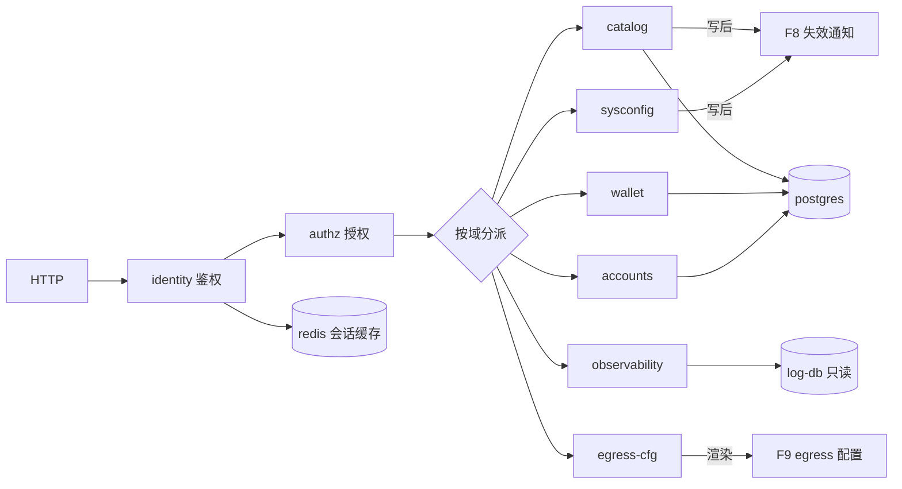

# control — 管理控制面

- 二进制：`control`
- 技术栈：Rust / axum / sqlx
- 监听：`:8081`
- 副本：2（其中 1 个持有迁移锁）
- 承接：266 条路由（`api-router.go` 220 + `channel-router.go` 40 + `authz-router.go` 1 + `dashboard.go` 4，其余为内建 setup/status）
- Go 来源：`controller/` 除 relay/video_proxy/playground 外的 72 个文件（26679 行）+ `oauth/`（72 个导出符号）+ `setting/`（10 子包）+ `model/` 写侧
- 依赖：postgres、redis、log-db（只读查询）
- **独占职责**：DB 迁移（今天 `model/main.go:197`、`:241` 用 `!IsMasterNode` 跳过）

---

## 1. 内部功能

### 1.1 identity — 身份与会话（**gateway 不链接此模块**）

- JWT 签发 — `service/auth_token.go:60` `IssueAccessToken`
- JWT 解析 — `service/auth_token.go:85` `ParseAccessToken` / `:107` `ParseDashboardAccessToken`
- 安全证明签发/校验 — `service/auth_token.go:132` `IssueSecurityProof` / `:160` `VerifySecurityProof`
- 会话生命周期 — `service/auth_session.go`（16 符号）：`CreateLoginSession`、`ValidateLoginSession`（`:114`）、`RefreshLoginSession`、`RevokeByRefreshToken`、`ListLoginSessions`、`AdvanceCurrentSessionSecurity`
- 会话存储 — `model/user_session.go`（17 符号）：`CreateUserSession`、`GetUserSessionCached`（`:211`）、`RotateUserSessionRefresh`（`:451`）、`RevokeUserSession`（`:544`）、`AdvanceUserSessionAuthVersion`（`:656`）
- refresh cookie — `service/auth_session.go` `WriteRefreshCookie` / `ClearRefreshCookie`
- 鉴权版本栅栏 — `model/user_auth_cache.go:250-271` Redis Lua 脚本
- passkey / WebAuthn — `service/passkey/`（`service.go`、`session.go`、`user.go` 共 11 符号）+ `model/passkey.go`（10 符号）
- 2FA — `model/twofa.go`（18 符号）+ `controller/twofa.go`（594 行）
- 密码/邮箱验证 — `controller/misc.go`、`controller/secure_verification.go`
- OAuth provider — `oauth/`：`github.go`、`discord.go`、`oidc.go`、`linuxdo.go`、`generic.go`、`provider.go`、`registry.go`（72 个导出符号）
- 微信 / Telegram — `controller/wechat.go`、`controller/telegram.go`
- 自定义 OAuth — `controller/custom_oauth.go`（584 行）+ `model/custom_oauth_provider.go`
- 外部身份声明 — `model/external_identity_claim.go`
- OAuth 绑定 — `model/user_oauth_binding.go`（11 符号）
- 认证流 — `model/auth_flow.go`（11 符号）

### 1.2 authz — 权限

- casbin enforcer — `service/authz/enforcer.go`（含 master 闸种子写入、60s 策略轮询）
- casbin 适配器 — `service/authz/adapter.go`
- 权限定义 — `service/authz/permission.go`、`registry.go`
- 渠道权限（5 种）— `service/authz/resources_channel.go:14-18`：`ChannelRead`、`ChannelOperate`、`ChannelWrite`、`ChannelSensitiveWrite`、`ChannelSecretView`
- 系统权限 — `service/authz/resources_system.go:9` `SystemSettings`
- 角色 — `service/authz/role.go` + `model/authz_role.go`
- 用户级覆盖 — `service/authz/override.go`（8 符号）：`SetUserPermissions`、`ClearUserAuthorization`、`ExplicitUserOverrides`
- 解析 — `service/authz/resolver.go`、`assignment.go`
- 种子 — `service/authz/seed.go`
- 策略表 — `model/casbin_rule.go`
- 权限目录 API — `controller/authz.go` → `GET /api/authz/catalog`

### 1.3 catalog — 渠道与定价写侧（写后必发 F8 失效通知）

- 渠道 CRUD — `controller/channel.go`（2228 行，26 个 handler）
- 渠道模型 — `model/channel.go`（64 符号）
- 能力表 — `model/ability.go`（14 符号）
- 缓存写侧 — `model/channel_cache.go:275` `CacheUpdateChannelStatus` / `:296` `CacheUpdateChannel`（**今天只改本进程内存**）
- 定价 — `model/pricing.go`（7 符号）+ `model/pricing_refresh.go` + `controller/pricing.go`
- 定价失效 — `model/pricing.go` `InvalidatePricingCache`（**今天只改本进程内存**）
- 倍率同步 — `controller/ratio_sync.go`（1029 行）+ `controller/ratio_config.go`
- 模型元数据 — `model/model_meta.go`（11 符号）+ `controller/model_meta.go`
- 厂商元数据 — `model/vendor_meta.go`（8 符号）+ `controller/vendor_meta.go`
- 模型同步 — `controller/model_sync.go`（634 行）
- 缺失模型 — `controller/missing_models.go` + `model/missing_models.go`
- 预填分组 — `model/prefill_group.go`（10 符号）+ `controller/prefill_group.go`
- 渠道测活入口（手动触发）— `controller/channel-test.go:856` `TestChannel`
- 渠道余额 — `controller/channel-billing.go`
- 上游模型更新 — `controller/channel_upstream_update.go`（1106 行）
- Codex 凭证与用量 — `controller/codex_usage.go` + `service/codex_oauth.go` + `service/codex_models.go` + `service/codex_channel_models.go` + `service/codex_wham_usage.go`
- 渠道权限绑定 — `controller/channel_authz.go`
- 亲和缓存管理 — `controller/channel_affinity_cache.go`

### 1.4 wallet — 钱包与支付

- 用户充值 — `controller/topup.go`（511 行）
- Stripe — `controller/topup_stripe.go`（424 行）+ `setting/payment_stripe.go`
- Creem — `controller/topup_creem.go`（457 行）+ `setting/payment_creem.go`
- Waffo — `controller/topup_waffo.go`（431 行）+ `setting/payment_waffo.go`
- Waffo Pancake — `controller/topup_waffo_pancake.go`（528 行）+ `service/waffo_pancake.go`（21 符号）+ `setting/payment_waffo_pancake.go`
- 易支付 — `service/epay.go` + `controller/subscription_payment_epay.go`
- 充值记录 — `model/topup.go`（15 符号）
- 订阅计划与订单 — `model/subscription.go`（42 符号）+ `controller/subscription.go`（547 行）
- 订阅支付回调 — `controller/subscription_payment_{epay,stripe,creem,waffo_pancake}.go`
- 兑换码 — `model/redemption.go`（11 符号）+ `controller/redemption.go`
- 签到 — `model/checkin.go`（7 符号）+ `controller/checkin.go`
- 支付合规 — `controller/payment_compliance.go`
- 回调可用性 — `controller/payment_webhook_availability.go`

### 1.5 accounts — 用户与令牌

- 用户 CRUD — `controller/user.go`（1492 行，19 个 handler）+ `model/user.go`（70 符号）
- 用户缓存 — `model/user_cache.go`（7 符号）
- API 令牌 — `controller/token.go`（475 行）+ `model/token.go`（29 符号）
- 分组 — `controller/group.go` + `service/group.go`
- 用户通知 — `service/user_notify.go`、`service/notify-limit.go`、`service/webhook.go`
- 会话管理 API — `controller/auth_session.go`

### 1.6 observability — 观测与看板

- 日志查询 — `controller/log.go`（7 个 handler）+ `model/log.go`（19 符号）
- 用量看板 — `controller/usedata.go` + `model/usedata.go`（9 符号）+ `usedata_flow.go` + `usedata_rankings.go`
- 排行榜 — `controller/rankings.go` + `service/rankings.go`（11 符号，5 分钟 TTL）
- 性能指标 — `controller/perf_metrics.go` + `pkg/perf_metrics/`（13 个导出符号）+ `model/perf_metric.go`
- 性能设置 — `controller/performance.go`（385 行）
- 节点列表 — `controller/system_info.go` + `model/system_instance.go`（8 符号）
- 系统任务查询 — `controller/system_task.go` + `model/system_task.go`（24 符号）
- OpenAI 兼容用量 — `controller/billing.go` → `/v1/dashboard/billing/*`
- Uptime Kuma — `controller/uptime_kuma.go`
- 审计日志 — `controller/audit.go` + `middleware/audit.go`

### 1.7 sysconfig — 系统配置

- 配置读写 — `controller/option.go`（379 行）+ `model/option.go`（6 符号）
- 配置分发 — `model/option.go` `updateOptionMap`（100+ 键分派到各 setting 包）
- 倍率配置 — `setting/ratio_setting/`（6 文件，67 符号）
- 运营配置 — `setting/operation_setting/`（14 文件，67 符号）
- 模型配置 — `setting/model_setting/`（7 文件）
- 系统配置 — `setting/system_setting/`（7 文件）
- 控制台配置 — `setting/console_setting/`（2 文件）
- 计费配置 — `setting/billing_setting/`
- 性能配置 — `setting/performance_setting/`、`perf_metrics_setting/`
- 推理配置 — `setting/reasoning/`
- 全局配置管理器 — `setting/config/`
- 自动分组 — `setting/auto_group.go`、`setting/user_usable_group.go`
- 敏感词配置 — `setting/sensitive.go`
- 限流配置 — `setting/rate_limit.go`
- 首次安装 — `controller/setup.go` + `model/setup.go`
- 前端配置迁移 — `model/frontend_option_migration.go`

### 1.8 egress-cfg — 出网配置渲染（F9）

- 代理节点 CRUD — `controller/proxy.go`（727 行，15 个 handler）
- 节点模型 — `model/proxy_node.go`（5 符号），含 `ScopeType`/`ScopeValue` 分级
- 节点服务 — `service/proxy_node.go`（9 符号）：`CreateProxyNode`、`CreateProxyNodesBatch`、`SetProxyNodesEnabled`、`ClearProxyNodeErrors`
- 分享链接解析 — `service/proxy_node_parser.go`（3 符号）
- 节点探测 — `service/proxy_node_probe.go`（9 符号）
- 全局代理配置 — `service/proxy_config.go`
- **新增职责**：把 `Option.proxy_config` + `proxy_nodes` 渲染成 sing-box outbound JSON 下发给 egress
- 协议注册参考 — `service/singbox_registry.go`（列出支持的 15 种 outbound）

### 1.9 migrate — 数据库迁移（**单点，必须选主**）

- 主库迁移 — `model/main.go:261-296` AutoMigrate 34 张表
- master 闸 — `model/main.go:197`、`:241` `if !common.IsMasterNode { return nil }`
- 方言分支 — `model/main.go:306-311` SQLite 专用建 `SubscriptionPlan`
- 日志库迁移 — `model/main.go:404` `LOG_DB.AutoMigrate(&Log{})`
- 鉴权版本回填 — `model/user_auth_cache.go` `InitializeUserAuthVersions`
- 外部身份回填 — `model/external_identity_claim.go` `InitializeExternalIdentityClaims`
- 权限种子 — `service/authz/seed.go`（master 闸）

---

## 2. 内部数据流动

### 2.1 中间件链（已核实）

全局（`api-router.go:16-20`）：
`RouteTag("api")` → `gzip` → `BodyStorageCleanup` → `GlobalAPIRateLimit`

分组链：
- `/api/user/`（self，`:83-84`）：`UserAuth`
- `/api/user/`（admin，`:133-134`）：`AdminAuth`
- `/api/subscription`（`:157-158`）：`UserAuth`
- `/api/subscription/admin`（`:169-170`）：`AdminAuth`
- `/api/option`（`:191-192`）：`AdminAuth` + `RequirePermission(authz.SystemSettings)`
- `/api/proxy`（`:206-207`）：`AdminAuth` + `RequirePermission(authz.SystemSettings)`
- `/api/custom-oauth-provider`（`:227-228`）：同上
- `/api/performance`（`:236-237`）：同上
- `/api/ratio_sync`（`:246-247`）：同上
- `/api/system-task`（`:298-299`）：同上
- `/api/system-info`（`:306-307`）：同上
- `/api/token`（`:253-254`）：`UserAuth`
- `/api/usage`（`:268-269`）：`CORS` + `CriticalRateLimit`；`/api/usage/token`（`:271-272`）再加 `TokenAuthReadOnly`
- `/api/redemption`（`:278-279`）：`AdminAuth`
- `/api/log`（`:321`）：`CORS` + `CriticalRateLimit`
- `/api/group`（`:325-326`）、`/api/prefill_group`（`:331-332`）、`/api/vendors`（`:350-351`）、`/api/models`（`:361-362`）：`AdminAuth`
- `/api/channel`（`channel-router.go:20-21`）：`AdminAuth`，再由每条路由自带 `RequirePermission`
- `/api/perf-metrics`（`:36-37`）：`HeaderNavModulePublicOrUserAuth("pricing")`
- `/v1/dashboard`（`dashboard.go:11-16`）：`RouteTag("old_api")` → `gzip` → `GlobalAPIRateLimit` → `CORS` → `TokenAuth`

无鉴权入口（支付回调，`api-router.go:59-64`、`:79-80`、`:188-189`）：
`/api/stripe/webhook`、`/api/creem/webhook`、`/api/waffo/webhook`、
`/api/waffo-pancake/webhook/:env`、`/api/user/epay/notify`、`/api/subscription/epay/notify`
→ **必须靠外部订单号唯一约束保证幂等**（多副本任一台都可能收到重复回调）

### 2.2 路由按前缀分组（266 条）

- `/api/user` — 65 条：用户 CRUD `user.go`(19)、会话 `auth_session.go`(5)、2FA `twofa.go`(8)、passkey `passkey.go`(9)、充值 `topup.go`(8)、分组 `group.go`(2)、Stripe(2)/Creem(1)/Waffo(2)/Pancake(2)、签到 `checkin.go`(2)、自定义 OAuth `custom_oauth.go`(4)、`misc.go`(1)
- `/api/channel` — 40 条：`channel.go`(26)、`channel_upstream_update.go`(4)、`codex_usage.go`(3)、`channel-test.go`(2)、`channel-billing.go`(2)、`model.go`(2)。其中 39 条表驱动注册（`channel-router.go:39-79`），每条带 `authz.Permission`
- `/api/subscription` — 22 条：`subscription.go`(15) + epay(4)/stripe(1)/creem(1)/pancake(1)
- `/api/proxy` — 15 条：`proxy.go`
- `/api/option` — 11 条：`option.go`(2)、`topup_waffo_pancake.go`(5)、`channel_affinity_cache.go`(2)、`payment_compliance.go`(1)、`pricing.go`(1)
- `/api/models` — 10 条：`model_meta.go`(6)、`model_sync.go`(2)、`model.go`(1)、`missing_models.go`(1)
- `/api/token` — 10 条：`token.go`
- `/api/log` — 8 条：`log.go`(7)、`channel_affinity_cache.go`(1)
- `/api/oauth` — 8 条：`oauth.go`(2)、`telegram.go`(3)、`wechat.go`(2)、`user.go`(1)
- `/api/redemption` — 7 条
- `/api/custom-oauth-provider` — 6 条
- `/api/performance` — 6 条
- `/api/vendors` — 6 条
- `/api/data` — 5 条：`usedata.go`
- `/api/prefill_group` — 4 条
- `/api/system-task` — 4 条
- `/api/system-info` — 3 条
- `/api/dashboard` + `/v1/dashboard` — 4 条：`billing.go`
- 2 条一组：`/api/ratio_sync`、`/api/perf-metrics`、`/api/setup`、`/api/status`、`/api/task`、`/api/mj`
- 单条：`/api/authz/catalog`、`/api/pricing`、`/api/rankings`、`/api/ratio_config`、`/api/group`、`/api/notice`、`/api/about`、`/api/home_page_content`、`/api/user-agreement`、`/api/privacy-policy`、`/api/reset_password`、`/api/verification`、`/api/verify`、`/api/uptime/status`、`/api/usage/token`

### 2.3 模块流转



### 2.4 模块间的边与不变量

- identity → authz：`Principal`（含 role、显式权限覆盖）。会话失效必须立即拒绝，靠 `AuthVersion` 栅栏
- authz → 各域：权限判定结果。**收紧权限时有最长 60s 传播窗口**（`service/authz/enforcer.go` 策略轮询），建议同时发 F8
- catalog → cache：写完事务、**提交之后**发失效通知。提交前发会让订阅者读到旧数据
- sysconfig → 各 setting 模块：约 100 个配置键分派（`model/option.go` `updateOptionMap`）
- wallet → accounts：余额变更。必须与订单落在同一事务
- egress-cfg → egress：渲染后的配置 + reload 信号
- 所有域 → store：写操作用事务；行锁走 `model/locking.go` `lockForUpdate`

### 2.5 会话校验链（每个 `/api` 请求）

1. 取 Authorization header
2. `service/auth_token.go:107` `ParseDashboardAccessToken` 解 JWT
3. `service/auth_session.go:114` `ValidateLoginSession`
4. → `model/user_session.go:211` `GetUserSessionCached`（Redis 缓存 / PG 兜底）
5. 校验 `session.Status`、`RevokedAt`、`ExpiresAt`、`Version`、`UserAuthVersion` 五项
6. → `model.GetUserCache` 取用户快照，再校验 `Status` 与 `AuthVersion`
7. PAT 路径：`model.ValidateAccessToken` + `model.GetUserCache`

**栅栏不变量**（`model/user_auth_cache.go:250-271` Lua）：三个 Redis key —
`user:<id>`（快照）、`auth:user:fence:<id>`（待提交版本）、`auth:user:version:<id>`（已提交版本下限）。
写入快照时，若 incoming 版本低于 pending 或 committed 任一下限则拒绝写入。
`IncrementUserAuthVersionWithTx`（`:180`）在 DB 事务**提交前**先发 fence（fail-closed），提交后才放行。

---

## 3. 目录结构

```
bins/control/
├── Cargo.toml                    # 依赖: domain quota store log-store cache config
└── src/
    ├── main.rs
    ├── migrate.rs                # §1.9 独占迁移 ← model/main.go:197,241,261-296
    ├── routes.rs                 # 266 条挂载
    │
    ├── api/                      # §2.2 一个路由前缀一个文件
    │   ├── user.rs               # 65 条 ← controller/user.go(1492行)
    │   ├── channel.rs            # 40 条 ← controller/channel.go(2228行) + channel-router 表驱动
    │   ├── subscription.rs       # 22 条 ← controller/subscription.go(547行)
    │   ├── proxy_node.rs         # 15 条 ← controller/proxy.go(727行)
    │   ├── option.rs             # 11 条 ← controller/option.go(379行)
    │   ├── model_meta.rs         # 10 条 ← controller/model_meta.go + model_sync.go
    │   ├── token.rs              # 10 条 ← controller/token.go(475行)
    │   ├── log.rs                # 8 条  ← controller/log.go
    │   ├── oauth.rs              # 8 条  ← controller/oauth.go + wechat.go + telegram.go
    │   ├── redemption.rs         # 7 条
    │   ├── custom_oauth.rs       # 6 条  ← controller/custom_oauth.go(584行)
    │   ├── performance.rs        # 6 条
    │   ├── vendor.rs             # 6 条
    │   ├── usedata.rs            # 5 条
    │   ├── prefill_group.rs      # 4 条
    │   ├── system_task.rs        # 4 条
    │   ├── system_info.rs        # 3 条
    │   ├── dashboard.rs          # 4 条  ← controller/billing.go（OpenAI 兼容）
    │   ├── ratio_sync.rs         # ← controller/ratio_sync.go(1029行)
    │   ├── perf_metrics.rs
    │   ├── setup.rs
    │   ├── webhook.rs            # 支付回调，需幂等 ← api-router.go:59-64
    │   ├── authz.rs              # /api/authz/catalog
    │   └── misc.rs               # status/notice/about/pricing/rankings/verification
    │
    ├── identity/                 # §1.1  gateway 不链接
    │   ├── jwt.rs                # ← service/auth_token.go:60,85,107,132,160
    │   ├── session.rs            # ← service/auth_session.go(16符号) + model/user_session.go(17符号)
    │   ├── fence.rs              # ← model/user_auth_cache.go:250-271
    │   ├── passkey.rs            # ← service/passkey/ + model/passkey.go
    │   ├── twofa.rs              # ← model/twofa.go(18符号) + controller/twofa.go(594行)
    │   ├── password.rs           # ← controller/misc.go + secure_verification.go
    │   └── oauth/
    │       ├── github.rs discord.rs oidc.rs linuxdo.rs generic.rs
    │       ├── wechat.rs telegram.rs
    │       └── registry.rs       # ← oauth/registry.go + provider.go
    │
    ├── authz/                    # §1.2 ← service/authz/(30个导出符号)
    │   ├── enforcer.rs           # ← enforcer.go（策略轮询）
    │   ├── permission.rs         # ← permission.go + registry.go
    │   ├── resources.rs          # ← resources_channel.go:14-18 + resources_system.go:9
    │   ├── role.rs               # ← role.go + model/authz_role.go
    │   ├── override.rs           # ← override.go(8符号)
    │   └── seed.rs               # ← seed.go（master 闸）
    │
    ├── catalog/                  # §1.3 写后必发 F8
    │   ├── channel.rs            # ← controller/channel.go + model/channel.go(64符号)
    │   ├── ability.rs            # ← model/ability.go(14符号)
    │   ├── pricing.rs            # ← model/pricing.go + controller/pricing.go
    │   ├── ratio_sync.rs         # ← controller/ratio_sync.go
    │   ├── model_meta.rs         # ← model/model_meta.go(11符号)
    │   ├── vendor.rs             # ← model/vendor_meta.go(8符号)
    │   ├── prefill_group.rs      # ← model/prefill_group.go(10符号)
    │   ├── upstream_update.rs    # ← controller/channel_upstream_update.go(1106行)
    │   ├── codex.rs              # ← service/codex_*.go(4文件)
    │   └── invalidate.rs         # 发布 F8
    │
    ├── wallet/                   # §1.4
    │   ├── topup.rs              # ← controller/topup.go(511行)
    │   ├── stripe.rs creem.rs waffo.rs pancake.rs epay.rs
    │   ├── subscription.rs       # ← model/subscription.go(42符号)
    │   ├── redemption.rs         # ← model/redemption.go(11符号)
    │   ├── checkin.rs
    │   └── compliance.rs         # ← controller/payment_compliance.go
    │
    ├── accounts/                 # §1.5
    │   ├── user.rs               # ← model/user.go(70符号)
    │   ├── token.rs              # ← model/token.go(29符号)
    │   ├── group.rs              # ← service/group.go(8符号)
    │   └── notify.rs             # ← service/user_notify.go + webhook.go
    │
    ├── observability/            # §1.6
    │   ├── log_query.rs          # ← controller/log.go + model/log.go(19符号)
    │   ├── usage.rs              # ← model/usedata*.go(3文件)
    │   ├── rankings.rs           # ← service/rankings.go(11符号)
    │   ├── perf.rs               # ← pkg/perf_metrics/(13个导出符号)
    │   ├── instances.rs          # ← model/system_instance.go(8符号)
    │   ├── task_view.rs          # ← model/system_task.go(24符号)
    │   └── audit.rs              # ← controller/audit.go + middleware/audit.go
    │
    ├── sysconfig/                # §1.7 ← setting/ 10个子包
    │   ├── option.rs             # ← model/option.go + controller/option.go
    │   ├── ratio.rs              # ← setting/ratio_setting/(6文件,67符号)
    │   ├── operation.rs          # ← setting/operation_setting/(14文件,67符号)
    │   ├── model_setting.rs      # ← setting/model_setting/(7文件)
    │   ├── system.rs             # ← setting/system_setting/(7文件)
    │   ├── console.rs billing.rs payment.rs reasoning.rs
    │   └── setup.rs              # ← controller/setup.go + model/setup.go
    │
    └── egress_cfg/               # §1.8 F9
        ├── node.rs               # ← model/proxy_node.go + service/proxy_node.go(9符号)
        ├── parser.rs             # ← service/proxy_node_parser.go
        ├── probe.rs              # ← service/proxy_node_probe.go(9符号)
        └── render.rs             # 渲染 sing-box outbound（参考 service/singbox_registry.go 的15种协议）
```

---

## 4. 2 副本时的注意事项

- **DB 迁移必须单点** — `model/main.go:197`、`:241` 今天用 `NODE_TYPE` 环境变量选主。两副本同时迁移会并发 `ALTER`。建议改成独立 init 容器或 PG advisory lock
- **权限种子单点** — `service/authz/seed.go` 同理
- **支付回调需幂等** — 无鉴权入口，任一副本都可能收到重复回调，按外部订单号加唯一约束
- **casbin 策略最终一致** — 每副本内存快照 60s 轮询。放宽权限延迟生效可接受；收紧权限有 60s 窗口，建议配合 F8
- **会话安全** — 会话在 PG + Redis，不在进程内，多副本天然安全（`service/auth_session.go:114`）
