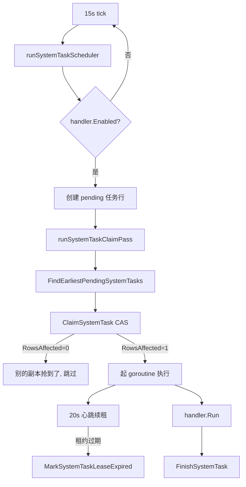

# worker — 后台任务

- 二进制：`worker`
- 技术栈：Rust / tokio（无业务 HTTP 端口，只有 `/healthz`）
- 副本：N（DB 租约天然去重）
- Go 来源：`service/system_task.go`（13 符号）+ `controller/system_task_handlers.go` + `service/task_polling.go`（6 符号）+ `controller/channel-test.go`（1095 行）+ `controller/channel_upstream_update.go`（1106 行）+ `main.go:103-159` 的一批 goroutine
- 依赖：postgres、redis、log-db（写）、外部 AI 上游（测活/轮询）

---

## 1. 内部功能

### 1.1 scheduler — 调度框架（**已经是集群安全的，可直接搬**）

- 入口 — `service/system_task.go` `StartSystemTaskRunner`
- master 闸 — `service/system_task.go:125` `if !common.IsMasterNode { return }`
- 租约表 — `model/system_task.go` `SystemTaskLock`，**`type` 作主键**（一类任务全局只有一行）
- 抢租约 — `model/system_task.go` `ClaimSystemTask`：CAS `UPDATE`（`:247`）+ 检查 `RowsAffected == 0`（`:257`）
- 租约参数 — 60s 租约 + 20s 心跳续租；15s 空闲 tick / 15s 调度 tick / 30s 清理过期锁
- 过期清理 — `ExpireStaleSystemTaskLocks`
- 任务注册 — `service/system_task.go` `RegisterSystemTaskHandler`
- 手动入队 — `service/system_task.go` `EnqueueSystemTask`
- 进度上报 — `service/system_task.go` `NewSystemTaskProgressReporter`
- handler 接口 — `Type()` / `Enabled()` / `Interval()` / `NewPayload()` / `Run(ctx, task, runnerID)`
- 任务查询 — `model/system_task.go`（24 符号）：`FindEarliestPendingSystemTasks`、`GetLatestSystemTasks`、`UpdateSystemTaskState`、`FinishSystemTask`、`MarkSystemTaskLeaseExpired`

### 1.2 五个租约任务

任务类型常量在 `model/system_task.go:19-23`：

- **`log_cleanup`** — 日志清理。`service/system_task.go` `StartLogCleanupTask` + `LogCleanupPayload` / `LogCleanupState` / `LogCleanupResult`。写 log-db
- **`channel_test`** — 渠道测活。`controller/system_task_handlers.go:32` `channelTestHandler`；周期由 `operation_setting.GetMonitorSetting().AutoTestChannelMinutes` 决定，默认 10 分钟（`:38-44`）；实现 `controller/channel-test.go:76` `testChannel`（**用 `httptest.NewRecorder` + `gin.CreateTestContext` 复用整条 relay 链路**）；有外部网络调用
- **`model_update`** — 上游模型列表同步。`controller/system_task_handlers.go:75` `modelUpdateHandler`；周期由环境变量 `CHANNEL_UPSTREAM_MODEL_UPDATE_TASK_INTERVAL_MINUTES` 决定（`:81-87`）；实现 `controller/channel_upstream_update.go`（1106 行）；有外部网络调用
- **`midjourney_poll`** — MJ 任务轮询。`controller/system_task_handlers.go:120` `midjourneyPollHandler`；**15 秒**（`:126`）；`Enabled()` 带 `HasUnfinished` 判断，空闲时不建任务行；有外部网络调用
- **`async_task_poll`** — 视频/音频异步任务轮询。`controller/system_task_handlers.go:140` `asyncTaskPollHandler`；**15 秒**（`:146`）；实现 `service/task_polling.go:108` `RunTaskPollingOnce`；有外部网络调用

### 1.3 异步任务轮询细节

- 主循环 — `service/task_polling.go:108` `RunTaskPollingOnce`
- 超时清扫 — `service/task_polling.go:44` `sweepTimedOutTasks`（用 `model.GetTimedOutUnfinishedTasks`）
- 平台分派 — `service/task_polling.go:179` `DispatchPlatformUpdate`
- Suno 更新 — `service/task_polling.go:196` `UpdateSunoTasks`
- 视频更新 — `service/task_polling.go:352` `UpdateVideoTasks`
- 任务模型 — `model/task.go`（34 符号）
- MJ 模型 — `model/midjourney.go`（18 符号）
- MJ 服务 — `service/midjourney.go`（5 符号）
- 任务计费调整 — `service/task_billing.go`（4 符号），由 `TaskAdaptor.AdjustBillingOnComplete`（`relay/channel/adapter.go:62`）的返回值触发
- 适配器工厂注入 — 今天在 `main.go:140-146` 用 `service.GetTaskAdaptorFunc` 注入，打破 service → relay 的循环依赖。Rust 侧不需要这个 hack（依赖图是单向的）

### 1.4 非租约后台任务（今天全在 `main.go`）

安全的（只读刷新本地状态）：
- `main.go:103` `SyncChannelCache` — 60s，刷新渠道缓存
- `main.go:111` `SyncOptions` — 60s，刷新配置
- `main.go:114` `authz.StartPolicySync` — 60s，刷新权限策略
- `main.go:135` `StartSystemInstanceReporter` — 30s，按 `NodeName` upsert 自己那行（`service/system_instance.go`，9 符号）

带 master 闸的：
- `main.go:128` `StartCodexCredentialAutoRefreshTask` — 10 分钟，`service/codex_credential_refresh_task.go`，过期前 24h 刷新
- `main.go:131` `StartSubscriptionQuotaResetTask` — 1 分钟，`service/subscription_reset_task.go`，批量 300
- `service/auth_cleanup.go` `StartAuthArtifactCleanup` — 1 小时，清过期会话与认证流

**多副本不安全，必须处理的**：
- `main.go:117` `UpdateQuotaData` — 写进程内共享聚合 `model/usedata.go` `CacheQuotaData` → **归单点**
- `main.go:124` `AutomaticallyUpdateChannels` — `controller/channel-billing.go:498`，重复外呼上游 → **纳入租约**
- `main.go:159` `InitBatchUpdater` — `model/utils.go:23` `batchUpdateStores` 5 类进程内累加器 → **删除，走 PG 原子更新**

### 1.5 按需任务（非定时，由 control 触发）

- 代理节点探测 — `service/proxy_node_probe.go`（9 符号）：`ProbeProxyNode`、`ApplyProxyNodeProbeSuccess` / `ApplyProxyNodeProbeFailure`（写健康状态、失败计数、冷却时间到 DB）
- 排行榜快照 — `service/rankings.go`（11 符号），5 分钟 TTL 缓存

---

## 2. 内部数据流动

### 2.1 一轮调度的流转



### 2.2 模块间的边与不变量

- scheduler → job：传 `task` 行 + `runnerID`。**同一 `type` 同时只有一个 runner 在跑**，靠 `SystemTaskLock` 主键保证
- job → store：任务状态写回。必须与租约续租竞争安全 —— `UpdateSystemTaskState` 带 `EXISTS` 子查询校验锁仍属于自己
- job → 外部上游：测活、模型拉取、任务轮询。**必须有超时**，否则拖垮心跳
- job → log-store：任务日志与清理
- task_poll → billing：`AdjustBillingOnComplete` 返回的配额差额触发补扣/退款。**必须与 gateway 的预扣记录对齐**，靠 `SubscriptionPreConsumeRecord` 表

### 2.3 心跳与租约的时序

- 租约 TTL 60s，心跳每 20s 续租 → 允许 2 次心跳失败
- 心跳失败超过 TTL → `MarkSystemTaskLeaseExpired` 把任务标为失败，另一副本可重新抢
- **不变量**：任务 handler 必须幂等。租约过期后重跑是正常路径，不是异常

### 2.4 与 gateway 的职责边界

- gateway 只做**同步**计费（预扣 → 结算/退款，在一次请求内闭环）
- worker 做**异步**任务的终态计费（提交时预扣、轮询到终态后补扣或退款）
- 交界点：`model/task.go` 的任务行 + `service/task_billing.go`
- gateway 提交任务时写 `Task` 行并预扣；worker 轮询到终态后调 `AdjustBillingOnComplete` 结算差额

---

## 3. 目录结构

```
bins/worker/
├── Cargo.toml                    # 依赖: domain quota store log-store cache config adaptor upstream
└── src/
    ├── main.rs                   # 启动、healthz、优雅关闭（等当前 job 跑完）
    ├── scheduler/                # §1.1
    │   ├── mod.rs                # ← service/system_task.go StartSystemTaskRunner
    │   ├── lease.rs              # ← model/system_task.go:247 CAS + :257 RowsAffected
    │   ├── heartbeat.rs          # 20s 续租
    │   ├── registry.rs           # ← service/system_task.go RegisterSystemTaskHandler
    │   └── progress.rs           # ← service/system_task.go NewSystemTaskProgressReporter
    │
    └── jobs/
        ├── mod.rs                # trait Job { fn type_id/enabled/interval/run }
        │
        ├── channel_test.rs       # ← controller/channel-test.go:76 testChannel（1095行）
        │                         #   注意: Go 版用 httptest 复用 relay 链路,
        │                         #   Rust 侧直接调 adaptor + upstream, 不用假 HTTP
        ├── model_update.rs       # ← controller/channel_upstream_update.go（1106行）
        ├── mj_poll.rs            # ← controller/system_task_handlers.go:120（15s）
        ├── task_poll.rs          # ← service/task_polling.go:108 RunTaskPollingOnce
        │   ├── sweep.rs          # ← service/task_polling.go:44 sweepTimedOutTasks
        │   ├── dispatch.rs       # ← service/task_polling.go:179
        │   ├── suno.rs           # ← service/task_polling.go:196
        │   └── video.rs          # ← service/task_polling.go:352
        ├── log_cleanup.rs        # ← service/system_task.go StartLogCleanupTask
        │
        ├── channel_balance.rs    # ← controller/channel-billing.go:498（新纳入租约）
        ├── usage_flush.rs        # ← model/usedata.go（改为单点, 原 main.go:117）
        ├── codex_refresh.rs      # ← service/codex_credential_refresh_task.go（10分钟）
        ├── subscription_reset.rs # ← service/subscription_reset_task.go（1分钟）
        ├── auth_cleanup.rs       # ← service/auth_cleanup.go（1小时）
        ├── proxy_probe.rs        # ← service/proxy_node_probe.go（9符号, 按需）
        ├── rankings.rs           # ← service/rankings.go（11符号, 5分钟TTL）
        └── heartbeat.rs          # ← service/system_instance.go（30s, 按NodeName upsert）
```

---

## 4. N 副本时的情况

**已经安全的**（DB 租约去重）：5 个租约任务全部安全。`SystemTaskLock` 以 `type` 为主键，
CAS 抢锁（`model/system_task.go:247`）+ `RowsAffected` 检查（`:257`），
抢不到的副本直接跳过。这套机制今天就在跑，直接搬。

**心跳任务安全**：`service/system_instance.go` 按 `NodeName` upsert 自己那行，各副本互不干扰。
拆分后建议给这张表加"角色"字段（gateway / control / worker），否则看不出哪台在干什么。

**必须处理的 3 个**：
- `UpdateQuotaData`（`main.go:117`）— 归单点，或改成从 log-db 聚合
- `AutomaticallyUpdateChannels`（`main.go:124` → `controller/channel-billing.go:498`）— 纳入租约体系
- `InitBatchUpdater`（`main.go:159` → `model/utils.go:23`）— 删掉，走 PG 原子更新

**master 闸的三个任务**（Codex 刷新、订阅重置、会话清理）— 今天靠 `NODE_TYPE` 环境变量，
Rust 侧直接纳入租约体系即可，不需要再有 master 概念。
