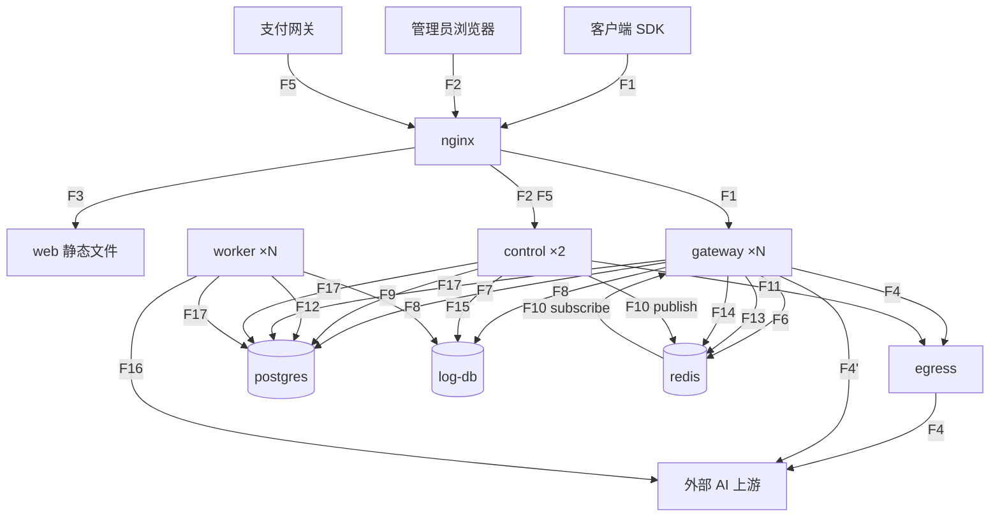

# 应用之间的数据流动

这份文档只讲**跨进程**的边。应用内部的模块流转在各自的应用文档里。

每条流的格式：路径 → 协议 → 载荷 → 同步性 → 今天的代码位置 → 拆分后的变化。

---

## 全局拓扑

---

## F1 — 推理请求流

- 路径：客户端 → nginx → gateway
- 协议：HTTPS；响应为 SSE 或 WebSocket
- 载荷：
  - OpenAI 兼容 — `/v1/chat/completions`、`/v1/completions`、`/v1/responses`、`/v1/responses/compact`、`/v1/embeddings`、`/v1/rerank`、`/v1/images/generations`、`/v1/images/edits`、`/v1/edits`、`/v1/audio/speech`、`/v1/audio/transcriptions`、`/v1/audio/translations`、`/v1/moderations`、`/v1/alpha/search`
  - Claude — `/v1/messages`
  - Gemini — `/v1beta/models/*`、`/v1beta/openai/models`
  - WebSocket — `/v1/realtime`（`router/relay-router.go:78`）
  - 异步任务 — `/mj/*`、`/:mode/mj/*`、`/suno/*`、`/kling/v1/*`、`jimeng/*`、`/v1/video/generations`、`/v1/videos/*`
  - 文件/微调 — `/v1/files/*`、`/v1/fine-tunes/*`
  - Playground — `/pg/chat/completions`（走 `UserAuth` 不是 `TokenAuth`）
- 同步性：同步，长连接（最长 3600s）
- 今天：`router/relay-router.go`（55 条）+ `router/video-router.go`（11 条）
- 拆分后变化：nginx 必须关缓冲，否则 SSE 增量输出被吞

## F2 — 管理请求流

- 路径：管理员浏览器 → nginx → control
- 协议：HTTPS + JSON
- 载荷：`/api/**` 261 条 + `/v1/dashboard` 4 条
- 鉴权：JWT access token（`service/auth_token.go:60` `IssueAccessToken`）
  + 服务端会话表校验（`service/auth_session.go:114` `ValidateLoginSession`
  → `model/user_session.go:211` `GetUserSessionCached`，Redis 缓存 / PG 兜底）
- 同步性：同步
- **关键事实**：gateway 完全不参与这条流。对 `relay/`、`controller/relay.go`、
  `middleware/distributor.go` 扫 `UserSession` / `ValidateLoginSession` / `ParseAccessToken` 零命中
- 拆分后变化：`/v1/dashboard` 前缀与 F1 的 `/v1` 重叠，nginx 必须让更长前缀优先匹配

## F3 — 前端资源流

- 路径：浏览器 → nginx → 静态文件
- 协议：HTTPS
- 载荷：JS / CSS / HTML / 字体 / 图标
- 同步性：同步
- 今天：走 gin embed（`main.go:42-46` + `router/web-router.go:28` `static.Serve`）
- 拆分后变化：nginx 直接托管 `dist`，embed 契约整个删除（详见 `05-nginx-web.md` §4）

## F4 — 出网流（经代理）

- 路径：gateway → egress → 外部 AI 上游
- 协议：SOCKS5 承载 HTTPS，流式双向
- 载荷：转换后的上游请求；上游 SSE 响应
- 同步性：同步流式
- 今天：进程内拨号 —— `relay/channel/api_request.go:491`
  `GetHttpClientWithProxySettings` → `service/http_client.go:286`
  → `service/singbox_dialer.go:339` `getSingBoxDialer` → 进程内 `box.Box`
- 拆分后变化：gateway 侧只剩 `reqwest::Proxy::all("socks5h://egress:1080")`，
  删掉 393 行 + 3 个 registry 文件 + 每请求 2 次多余 DB 查询

## F4' — 出网流（直连）

- 路径：gateway → 外部 AI 上游
- 协议：HTTPS
- 触发条件：渠道未配置代理
- 今天：`service/http_client.go:314` `transport.Proxy = http.ProxyFromEnvironment`
- 拆分后变化：无

## F5 — 支付回调流

- 路径：支付网关 → nginx → control
- 协议：HTTPS POST
- 载荷：Stripe / Creem / Waffo / Waffo-Pancake / 易支付的回调体
- 入口（**无鉴权**）：
  - `/api/stripe/webhook`（`api-router.go:59`）
  - `/api/creem/webhook`（`:60`）
  - `/api/waffo/webhook`（`:61`）
  - `/api/waffo-pancake/webhook/:env`（`:64`，handler 内校验 env 匹配）
  - `/api/user/epay/notify`（`:79-80`，GET + POST）
  - `/api/subscription/epay/notify`（`:188-189`，GET + POST）
- 同步性：同步
- **拆分后必须处理**：control 有 2 副本，任一副本都可能收到重复回调。
  必须按外部订单号加唯一约束保证幂等

## F6 — 鉴权读流

- 路径：gateway → redis →（miss）→ postgres
- 协议：RESP HGETALL / SQL SELECT
- 载荷：
  - token 快照 — key `token:<hmac>`（`model/token_cache.go:14`）
  - 用户快照 — key `user:<id>` HSET（`model/user_cache.go:51`）
- 同步性：同步，每请求 1-2 次
- 一致性：Redis Lua 版本栅栏（`model/user_auth_cache.go:250-271`），
  三个 key 协同拒绝旧快照写回（详见 `06-datastores.md` §9）
- 拆分后变化：无。这条已经是"Redis 权威缓存 + PG 兜底"，天然支持多副本

## F7 — 计费写流

- 路径：gateway → postgres（+ Redis 镜像）
- 协议：SQL UPDATE / RESP HINCRBY
- 载荷：token 余额、用户余额、渠道用量增减
- 同步性：**PG 同步，Redis 异步**（`model/token.go:405-421`：`gopool.Go` 写 Redis，DB 走同步）
- 今天的入口：`service/quota.go:387` `PreConsumeTokenQuota` / `:411` `PostConsumeQuota`
  → `model/token.go:405` `IncreaseTokenQuota` / `:435` `DecreaseTokenQuota`
- **陷阱**：`BatchUpdateEnabled` 时 `IncreaseTokenQuota` **直接 return 不写 DB**，
  只塞进 `model/utils.go:23` `batchUpdateStores` 的进程内 map，等 5s 后批量落库。
  多副本时各攒各的 → 账目错
- 拆分后必须处理：删掉批量模式，走 PG 单行原子 `UPDATE q = q - ?`

## F8 — 消费日志流

- 路径：gateway → log-db；worker → log-db
- 协议：SQL INSERT
- 载荷：一条消费日志（含 user/token/channel/model/quota/tokens/耗时/IP/request_id）
- 同步性：**今天同步，卡在用户响应路径上**
- 今天：`model/log.go:343` `RecordConsumeLog` → `:101` `createLog` → `LOG_DB.Create`；
  中间还夹一次 `GetUserSetting`（`:355`）判断要不要记 IP
- 拆分后必须改：`mpsc` channel + 批量 insert，gateway 侧 fire-and-forget

## F9 — 管理写流

- 路径：control → postgres
- 协议：SQL 事务
- 载荷：渠道、能力、定价、用户、令牌、订单、订阅、权限策略、代理节点、系统配置
- 同步性：同步事务
- 行锁：`model/locking.go` `lockForUpdate`
- 拆分后变化：**必须在事务提交之后**发 F10 失效通知。提交前发会让订阅者读到旧数据

## F10 — 缓存失效流（**今天不存在，必须新增**）

- 路径：control → redis pub/sub → gateway
- 协议：RESP pub/sub
- 载荷：`{kind: Channel|Pricing|Option|Authz, id: Option<i32>, version: u64}`，几十字节
- 同步性：异步，尽力而为
- 今天的替代品：60s 轮询
  - `model/channel_cache.go:106` `SyncChannelCache`（渠道 + 能力）
  - `model/option.go` `SyncOptions`（配置）
  - `service/authz/enforcer.go` `StartPolicySync`（权限策略）
- 为什么必须加：`model/channel_cache.go:296` `CacheUpdateChannel`、
  `:275` `CacheUpdateChannelStatus`、`model/pricing.go` `InvalidatePricingCache`
  **只改本进程内存**。单进程无感，拆开就是"我明明关了渠道它还在打"
- **正确性下限**（这条很重要）：Redis pub/sub 不持久、不重传、订阅者掉线就丢消息。
  所以：
  1. 订阅者收到消息后**不信任消息内容**，只把它当"去 PG 重读"的触发器
  2. **保留 60s 轮询作为兜底**
  3. pub/sub 只是把典型延迟从 60s 压到 1s，它不是唯一保证
- 谁发：control 的 `catalog` 与 `sysconfig` 模块，写完事务提交之后
- 谁收：gateway 的 `routing/snapshot.rs`

## F11 — 出网配置流（**今天不存在，必须新增**）

- 路径：control → egress
- 协议：写配置文件 + reload 信号（或 sing-box Clash API）
- 载荷：由 `Option.proxy_config` + `proxy_nodes` 表渲染的 sing-box outbound JSON
- 同步性：异步
- 今天：进程内按 DB 指纹重建 `box.Box`（`service/singbox_dialer.go:303` `outboundFingerprint`
  + `:339` `getSingBoxDialer`）
- 字段全集：见 `04-egress.md` §2.4（`service/singbox_dialer.go:95-123` `outboundConfigFields`）
- **注意**：必须保留嵌套的 `transport.headers`。
  `service/singbox_dialer.go:311-315` 的注释说明了原因 ——
  控制台把传输头存在 `transport.headers` 下，经由 `service/proxy_config.go` 的
  `OutboundConfig` 结构体往返会丢掉（它只有扁平的 `Host`）

## F12 — 任务租约流

- 路径：worker ⇄ postgres
- 协议：SQL INSERT + CAS UPDATE
- 载荷：60s 租约 + 20s 心跳续租
- 同步性：同步
- 今天：`model/system_task.go` `ClaimSystemTask`，CAS `UPDATE`（`:247`）
  + `RowsAffected == 0` 检查（`:257`）；`SystemTaskLock` 以 `type` 为主键
- 状态：**已经是集群安全的**，可直接搬
- 不变量：任务 handler 必须幂等。租约过期后重跑是正常路径

## F13 — 指标流

- 路径：gateway → redis
- 协议：RESP HINCRBY 管道
- 载荷：请求数、成功数、时延、TTFT、输出 token、生成时长
- 同步性：异步（fire-and-forget）
- 今天：`pkg/perf_metrics/metrics.go:381-404`，key `perf:<...>:<...>:<ts>`（`:427`），TTL 1 小时
- 读取方：control 的 `/api/perf-metrics`（2 条路由）+ worker 的落库任务
- 拆分后变化：无。已经是 Redis 权威

## F14 — 渠道亲和流

- 路径：gateway ⇄ redis
- 协议：RESP GET / SET
- 载荷：用户 → 渠道粘性映射
- 同步性：读同步（选渠道前），写异步（请求成功后）
- 今天：`service/channel_affinity.go:93` `cachex.HybridCache[int]`，
  命名空间 `new-api:channel_affinity:v1`（`:29`）；读 `:550` `GetPreferredChannelByAffinity`，
  写 `:713` `RecordChannelAffinity`
- 多副本要求：Redis 必开，否则各副本亲和不互通（会退化到本地 LRU）

## F15 — 日志查询流

- 路径：control → log-db
- 协议：SQL SELECT
- 载荷：日志分页查询、用量聚合
- 同步性：同步
- 今天：`controller/log.go` 的 7 个 handler + `model/log.go`（19 符号）

## F16 — 主动外呼流

- 路径：worker → 外部 AI 上游
- 协议：HTTPS
- 载荷：
  - 渠道测活请求（`controller/channel-test.go:76` `testChannel`）
  - 上游模型列表拉取（`controller/channel_upstream_update.go`）
  - 异步任务状态轮询（`service/task_polling.go:108` `RunTaskPollingOnce`）
  - 渠道余额查询（`controller/channel-billing.go:498`）
- 同步性：异步，按 tick 触发
- **必须有超时**，否则拖垮租约心跳

## F17 — 节点心跳流

- 路径：所有应用（gateway / control / worker）→ postgres
- 协议：SQL UPSERT（`on conflict do update`）
- 载荷：`node_name`、启动时间、是否 master、CPU / 内存 / 磁盘
- 同步性：异步，30s
- 今天：`service/system_instance.go`（9 符号），`model/system_instance.go` `UpsertSystemInstance`，
  过期阈值 90s
- 拆分后需要补：**角色字段**（gateway / control / worker），
  否则拆开后 `/api/system-info` 看不出哪台在干什么

---

## 拆分前后的流对照

今天存在、拆分后消失的：
- 进程内 sing-box 拨号（F4 的内部实现）
- 进程内渠道/定价缓存的直接读写（被 F10 替代）
- gin embed 静态文件服务（被 F3 替代）
- 批量记账的进程内累加（F7 的一条分支）

今天不存在、拆分后必须新增的：
- **F10 缓存失效流** — 唯一需要新造的分布式机制
- **F11 出网配置流** — control 渲染 + egress 热重载
- F17 的角色字段

今天就已经正确、可以直接搬的：
- F6 鉴权读（Redis 权威 + PG 兜底 + Lua 版本栅栏）
- F12 任务租约（DB CAS + 心跳）
- F13 指标（Redis HINCRBY）
- F14 亲和（HybridCache）

今天有问题、拆分时必须一起修的：
- F7 的批量记账分支（多副本账目错）
- F8 的同步日志写（卡响应路径）
- F5 的回调幂等（多副本重复处理）
