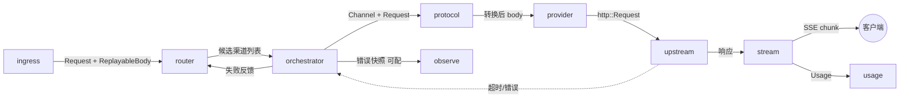
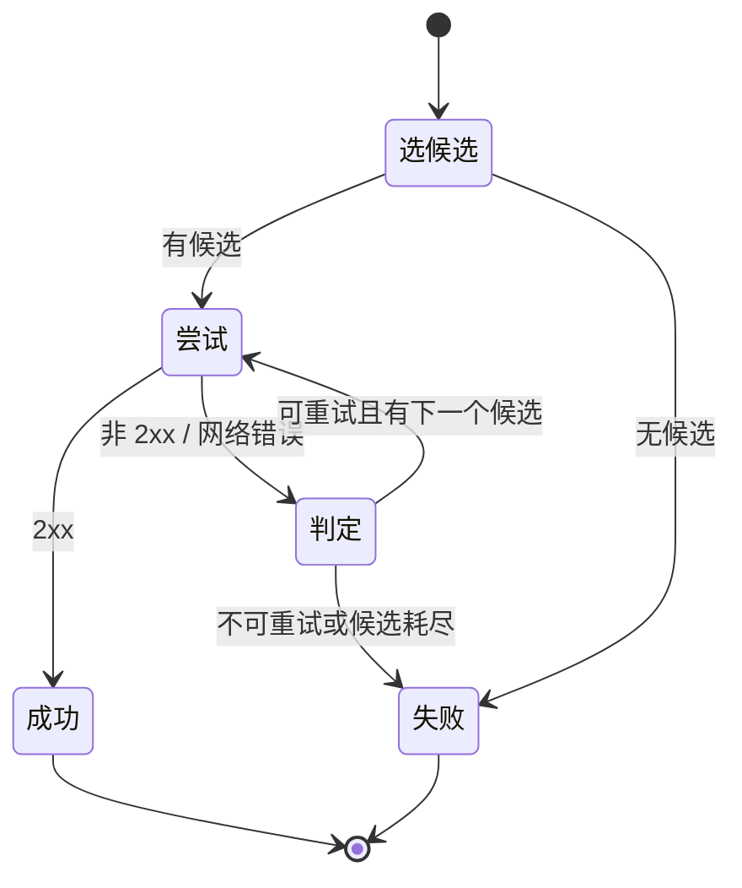
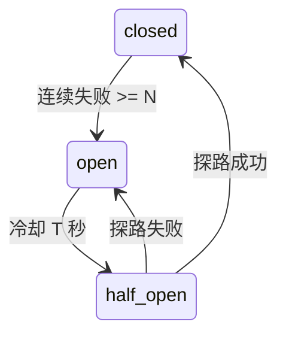
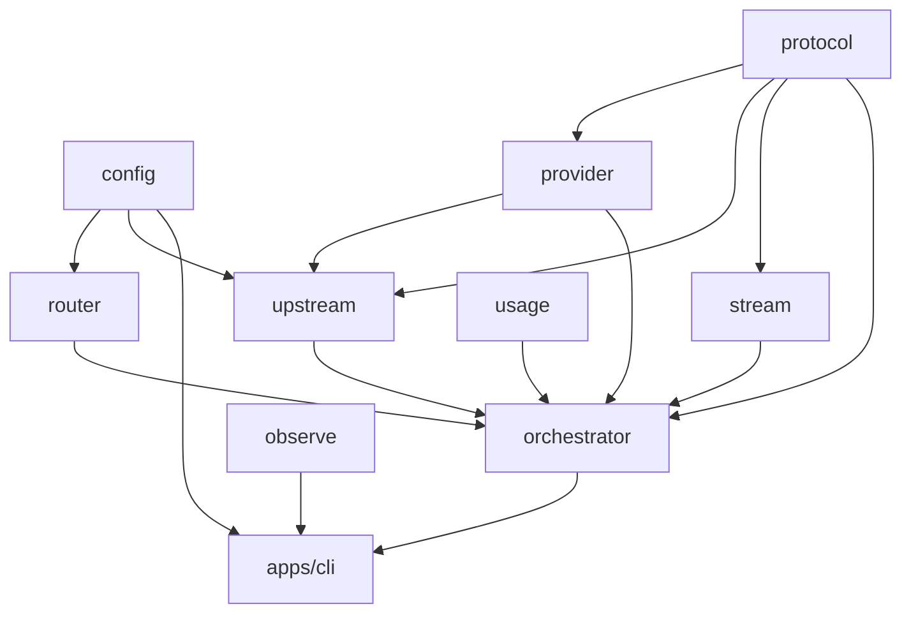

# MVP — `gateway` 单二进制 CLI

- 二进制：`gateway`
- 技术栈：Rust / axum / reqwest / tokio
- 监听：`127.0.0.1:8080`（默认只听本地）
- 副本：1
- 外部依赖：**零**。没有数据库、没有 Redis、没有 nginx
- 配置：单个 TOML 文件
- 状态：进程内 + 一个本地 JSONL 文件

一句话：**把多个上游 AI 供应商收敛成一个本地端点，agent 只需要改一个环境变量。**

```
gateway --config ~/.config/gateway.toml
export OPENAI_BASE_URL=http://127.0.0.1:8080/v1
```

---

## 1. 内部功能

### 1.1 config — 配置（`crates/config`）

- 解析 TOML，反序列化成 `Config`
- 启动时校验：渠道名唯一、`base_url` 可解析、`models` 非空、至少一个渠道启用
- 校验失败**拒绝启动**并打印具体哪一行错，不要带着半个坏配置跑起来
- `SIGHUP` 重载：重新读文件 → 校验 → 通过才原子替换；校验失败保留旧配置并报错
- 展开环境变量：`api_key = "env:OPENAI_KEY"` 形式，避免密钥明文进配置文件
- 子命令 `gateway check` — 只校验配置并退出，供 CI 用

配置结构：

```toml
listen = "127.0.0.1:8080"
log_level = "info"
usage_log = "~/.local/share/gateway/usage.jsonl"

[[channel]]
name       = "openai-main"
type       = "openai"
base_url   = "https://api.openai.com/v1"
api_key    = "env:OPENAI_KEY"
models     = ["gpt-4o", "gpt-4o-mini"]
priority   = 10                     # 数字大的先选
weight     = 1                      # 同优先级内的加权轮询
timeout_ms = 120000
enabled    = true

[[channel]]
name     = "openai-backup"
type     = "openai"
base_url = "https://backup.example.com/v1"
api_key  = "env:BACKUP_KEY"
models   = ["gpt-4o"]
priority = 5                        # 主渠道失败才轮到它

[[channel]]
name     = "local-ollama"
type     = "ollama"
base_url = "http://127.0.0.1:11434"
models   = ["qwen3:8b"]
priority = 1

[retry]
max_attempts   = 3
retry_on       = [429, 500, 502, 503, 504]
backoff_ms     = 200

[observe.capture]                   # §1.9 错误快照, 全部可配
enabled        = true
on             = ["upstream_5xx", "timeout", "convert_failed", "no_channel"]
max_body_bytes = 0                  # 默认不存请求体
retain_days    = 7

[model_alias]                       # 客户端写左边, 实际请求右边
"gpt-4"     = "gpt-4o"
"claude"    = "claude-sonnet-4"
```

### 1.2 ingress — 入站（`apps/cli/src/routes` + `crates/upstream/src/body.rs`）

- axum 路由，只挂 relay 端点
- 端点：
  - `POST /v1/chat/completions`
  - `POST /v1/completions`
  - `GET  /v1/models` — 由配置聚合出来（各渠道 `models` 去重 + 别名）
  - `GET  /healthz`
- 请求体读取与**可重放存储**：小体留内存，超阈值落临时文件。重试必须能重新读一遍
- 请求体上限（配置项），超限直接 413
- 解析出 `model` 字段：用流式 JSON 取值，不反序列化整个 body（大附件请求体可能几十 MB）
- 应用模型别名映射
- 分配 `request_id`，贯穿日志与响应头
- 可选 bearer token 校验：配置里写死一个静态 token，只为防止本机其他进程误用。
  **不是多用户系统**，没有 token 表

### 1.3 router — 渠道选择（`crates/router`）

- 输入 `model` 名，输出候选渠道**有序列表**（不是单个）
- 选择规则：
  1. 过滤：`enabled = true` 且 `models` 包含目标模型
  2. 按 `priority` 降序分层
  3. 同层内按 `weight` 加权轮询（轮询游标是进程内 `AtomicUsize`）
  4. 熔断中的渠道排到最后（不是直接剔除，全挂时还得有得选）
- 无候选 → 400 并列出可用模型名，不要返回裸 500
- 熔断器：连续 N 次失败标记 `open`，冷却 T 秒后 `half-open` 放一个请求探路。
  N 与 T 走配置
- 状态全在进程内：`RwLock<Snapshot>` + 每渠道一个原子计数器

### 1.4 protocol — 格式转换（`crates/protocol`）

MVP 只做 OpenAI 入站，但转换层从第一天就要分离出来，否则后面加格式要动路由。

- 入站格式识别：由路由路径决定（MVP 只有 OpenAI）
- 出站格式：由渠道 `type` 决定
- 同格式（openai → openai）走**透传**：不做任何 DTO 往返，直接改 URL 与 auth header。
  这是最常见的路径，多余的序列化/反序列化纯属浪费
- 跨格式预留 `convert(from, to, body)` 接口，MVP 里只有一个恒等实现
- 请求参数覆盖：渠道级 `param_override`，合并进请求体（比如给某渠道强制 `temperature`）

**可选标量字段必须区分"未传"与"显式传 0"**：全部用
`Option<T>` + `#[serde(skip_serializing_if = "Option::is_none")]`。
非可选类型配 skip 会把 `temperature: 0` 静默丢掉，上游收不到。

### 1.5 provider — 上游适配（`crates/provider`）

一个 trait，每个 `type` 一个实现。MVP 实现 3 个：`openai`、`openai-compatible`、`ollama`。

trait 只做**请求/响应变换**，不碰配置、不碰状态、不碰 IO：

```rust
trait Provider {
    fn name(&self) -> &'static str;
    fn build_url(&self, ch: &Channel, endpoint: Endpoint) -> Result<Url>;
    fn build_headers(&self, ch: &Channel, h: &mut HeaderMap) -> Result<()>;
    fn build_body(&self, ch: &Channel, req: &Request) -> Result<Bytes>;
    fn parse_response(&self, resp: &Response) -> Result<Usage>;
    fn parse_stream_chunk(&self, chunk: &[u8]) -> Result<StreamDelta>;
    fn classify_error(&self, status: u16, body: &[u8]) -> ErrorKind;
}
```

`classify_error` 是关键：把上游的错误映射成"可重试 / 不可重试 / 渠道该熔断"三类。
上游返回 400 是客户端的错（不重试），429/503 是渠道的错（重试 + 计入熔断），
401 是配置的错（不重试但要熔断，key 坏了）。

### 1.6 upstream — 出网（`crates/upstream`）

- 每渠道一个 `reqwest::Client`，连接池复用
- 超时分级：连接超时、首字节超时、整体超时各自配置。
  流式响应的整体超时必须很长（几十分钟），但首字节超时要短（几秒）
- 代理支持：`proxy = "socks5h://127.0.0.1:1080"` 或 `http://`。
  MVP 不内嵌任何代理协议栈，只做 SOCKS5/HTTP 客户端
- 重试循环在这一层之上（router 给出候选列表，orchestrator 依次尝试）
- 请求体重放：每次尝试从可重放存储重新取 reader

### 1.7 stream — 流式回传（`crates/stream`）

- SSE 逐 chunk 转发，**不缓冲整个响应**
- 单写者不变量：一条响应同时只有一个写者。ping 与数据帧共用一个 writer，
  用 mpsc 汇聚到单个写任务，而不是多个任务抢同一个 writer
- 心跳：长时间无上游数据时发注释帧保活（可关）
- 写超时：客户端不读时不能无限阻塞
- 客户端断开检测：立刻取消上游请求，不要让上游继续跑完（省钱）
- 累计 usage：从流末尾的 usage 帧取，取不到就用本地估算
- 非流式路径单独走，不要为了复用把非流式塞进流式管道

### 1.8 usage — 用量记录（`crates/usage`）

- 每次请求结束追加一行 JSON 到本地文件
- 字段：`ts`、`request_id`、`model`、`channel`、`attempts`、`status`、
  `latency_ms`、`ttft_ms`、`prompt_tokens`、`completion_tokens`、`error_kind`
- **异步写**：mpsc channel + 批量 flush。写文件不能卡在响应路径上
- 按天滚动文件，保留 N 天（配置）
- 进程退出前 flush 未落盘的记录

### 1.9 observe — 可观测（`crates/observe` + `apps/cli/src/cmd`）

三条独立的输出,各自可单独开关:

**① 运行日志** — `tracing`,每请求一条 span。只进 stderr/文件,不含请求体

**② 用量记录** — §1.8 的 JSONL,每请求一行。只有数值与标识,不含内容

**③ 错误快照** — 出错时把**请求上下文**落盘,供事后排查。这是下面要详细说的

#### 错误快照:全部可配置

排障时最需要的是"那次失败的请求长什么样",但请求体可能含敏感内容、可能几十 MB。
所以每一项都要能关、能限、能过期。

```toml
[observe.capture]
enabled        = true          # 总开关, false 则完全不落盘
on             = ["upstream_5xx", "timeout", "convert_failed", "no_channel"]
                              # 只收这些类别; 留空数组 = 不收任何
exclude        = ["upstream_4xx"]
                              # 明确排除(客户端自己的错, 通常没必要存)

max_body_bytes = 65536        # 请求体最多存多少字节, 超过则截断并标记 truncated
                              # 0 = 完全不存请求体, 只存元信息
max_resp_bytes = 16384        # 上游响应体同理; 0 = 不存
max_files      = 1000         # 快照文件数上限, 超过按时间淘汰最旧的
max_total_mb   = 200          # 总体积上限, 先到先限
retain_days    = 7            # 保留天数; 0 = 不按时间清理(只受上面两个上限约束)

sample_rate    = 1.0          # 采样率, 1.0=全收。高频错误时降到 0.01 避免刷爆磁盘
redact_headers = ["authorization", "x-api-key", "cookie"]
                              # 这些 header 值替换成 <redacted>
redact_body_keys = []         # 请求体里要脱敏的 JSON 键路径, 如 ["messages"]
dir            = "~/.local/share/gateway/captures"
```

**默认值的选择**:`enabled = true` 但 `max_body_bytes = 0`。
即开箱就记录"哪个渠道什么时候因为什么失败了",但**不存任何请求内容**。
想看内容时再手动调大 —— 让隐私敏感的选择是显式的,不是默认的。

#### 类别取值

与 §1.5 `provider.classify_error` 的输出一一对应,不新造一套:

- `network` — 连不上、DNS 失败、TLS 握手失败
- `timeout` — 连接/首字节/整体三种超时,快照里记明是哪一种
- `upstream_4xx` — 上游拒绝(参数错、鉴权错)
- `upstream_5xx` — 上游故障
- `rate_limited` — 429
- `convert_failed` — 格式转换出错
- `no_channel` — 无可用渠道
- `stream_broken` — 流式中途断裂

#### 快照文件内容

一次错误一个文件,`<date>/<request_id>.json`:

```
request_id, ts, error_kind, error_detail
model_requested, model_upstream, channel_name, attempts[]   ← 重试链, 每次的渠道与错误
request:  { method, path, headers(已脱敏), body(截断/省略) }
upstream: { url(已脱敏), status, headers, body(截断/省略) }
timing:   { total_ms, ttft_ms, per_attempt_ms[] }
```

`attempts[]` 是排障的关键 —— 它回答"是所有渠道都挂了,还是重试策略选错了渠道"。

#### 清理机制

三个上限**同时生效**,任一触发就淘汰:

- `retain_days` — 后台任务每小时扫一次,删超期目录
- `max_files` / `max_total_mb` — 写入时检查,超了就删最旧的(FIFO)

写入路径上只做"删最旧"这一件事,按天扫描交给后台任务。
**不要在请求路径上做目录遍历**。

#### 子命令

- `gateway stat` — 读 JSONL 出统计:按模型/渠道/天聚合,成功率、P50/P95、TTFT、token 量
- `gateway errors` — 列最近的错误快照:时间、类别、渠道、模型、request_id
- `gateway errors <request_id>` — 打印单个快照全文
- `gateway errors --purge` — 手动按当前配置清理一次
- `gateway test [channel]` — 测活,实发最小请求,报延迟与错误
- `gateway check` — 只校验配置
- `gateway models` — 打印聚合模型表与各模型候选渠道

失败原因必须分类可查。agent 场景最痛的是"哪个渠道又挂了",
`gateway errors` 要能一眼看出来。

---

## 2. 内部数据流动

### 2.1 一次请求的模块流转



### 2.2 模块间的边

- **ingress → router**：`model` 名（已应用别名）。移动 `ReplayableBody` 所有权
- **router → orchestrator**：候选渠道有序列表。**必须是列表不是单个**，否则重试要回头再选一次
- **orchestrator → protocol**：`&Channel` + `&Request`。orchestrator 是唯一同时看到
  router / protocol / provider / stream 的地方
- **protocol → provider**：转换后的请求体。同格式透传时这条边是零拷贝
- **provider → upstream**：`http::Request`。出网策略只由 upstream 决定，
  provider 不自建 client
- **upstream → stream**：响应流。非流式走另一条边
- **stream → usage**：终态 usage，异步投递（mpsc，不阻塞）
- **orchestrator → observe**：错误快照，**仅在出错且配置允许时**投递。
  同样异步，且在投递前就完成截断与脱敏 —— 敏感内容不进 channel
- **orchestrator → router**：失败反馈，喂给熔断器计数

### 2.3 必须守住的不变量

- **请求体可重放 N 次** — 第 2 次尝试不能发空体。这是重试正确的前提
- **单写者** — 一条 SSE 响应同时只有一个写者。ping 和数据帧走同一个 mpsc
- **provider 无状态** — trait 方法不读全局配置、不碰熔断器、不写日志
- **usage 写不阻塞响应** — 异步 channel，队列满时丢弃并计数，不是阻塞
- **快照写不阻塞响应，且脱敏在投递前完成** — 截断与 redact 在 orchestrator 侧做完
  再进 channel。绝不允许"先把原始 body 送进队列，等落盘时再脱敏"
- **`max_body_bytes = 0` 必须真的不读 body** — 不是读完再丢，是根本不复制
- **配置替换原子** — 重载失败保留旧配置，绝不出现"一半新一半旧"
- **客户端断开即取消上游** — 不然客户端跑了上游还在计费

### 2.4 重试状态机



跨尝试必须保持：
1. 请求体从可重放存储重取
2. 已尝试渠道记入 `attempts`，写进 usage 日志（排障要看重试链）
3. 熔断计数按渠道累加，不因换渠道而清零

不可重试的判定来自 `provider.classify_error`：
上游 400/422（客户端错）不重试；401/403 不重试但熔断；
429/5xx/超时/连接失败重试。

### 2.5 熔断器状态机



熔断只影响**排序**，不影响可用性 —— 全部渠道熔断时仍然按原顺序尝试。
宁可打一个大概率失败的请求，也不要直接告诉客户端"无可用渠道"。

---

## 3. 目录结构

标准 workspace：`bin/` 放二进制,`crates/` 放库。**没有顶层 `src/`** ——
根 `Cargo.toml` 只是 workspace 清单,不是 package。

```
gateway/
├── Cargo.toml                    # [workspace] only, 不含 [package]
├── Cargo.lock
├── rust-toolchain.toml
├── deny.toml                     # cargo-deny: 依赖审计 + 许可证
│
├── apps/
│   └── cli/                      # 唯一二进制, 产物名 gateway
│       ├── Cargo.toml            # [[bin]] name = "gateway"
│       └── src/
│           ├── main.rs           # 入口: 解析 argv -> 分发子命令
│           ├── cmd/              # 一个子命令一个文件
│           │   ├── mod.rs
│           │   ├── run.rs        # 默认: 起服务
│           │   ├── check.rs      # 校验配置并退出
│           │   ├── stat.rs       # 读 JSONL 出统计
│           │   ├── test.rs       # 测活单个渠道
│           │   └── models.rs     # 打印聚合模型表
│           ├── server.rs         # §1.2 axum Router 组装 + listener
│           ├── routes/           # §1.2 端点处理器
│           │   ├── mod.rs
│           │   ├── chat.rs       # POST /v1/chat/completions, /v1/completions
│           │   ├── models.rs     # GET /v1/models
│           │   └── health.rs     # GET /healthz
│           ├── middleware/       # §1.2 塔层
│           │   ├── request_id.rs
│           │   ├── static_token.rs
│           │   └── body_limit.rs
│           ├── state.rs          # AppState: ArcSwap<Snapshot> + 各 crate 句柄
│           └── shutdown.rs       # SIGHUP 重载 / SIGTERM 优雅退出
│       └── tests/
│           ├── e2e_chat.rs       # 起真实 server + 假上游, 打通非流式与流式
│           ├── e2e_failover.rs   # 主渠道断开 -> 落到备用, attempts=2
│           └── cli_args.rs       # 子命令解析与退出码
│
└── crates/
    ├── config/                   # §1.1
    │   ├── Cargo.toml            # 依赖: serde, toml. 禁止依赖其他 crate
    │   ├── src/
    │   │   ├── lib.rs            # struct Config / Channel / Retry / ModelAlias
    │   │   ├── load.rs           # TOML 解析 + env: 展开  (#[cfg(test)] mod tests 在文件内)
    │   │   ├── validate.rs       # 启动前校验, 失败拒绝启动
    │   │   └── error.rs          # 带行号的配置错误
    │   └── tests/                # 集成测试: 只调 pub API
    │       └── load_validate.rs  # 喂坏配置, 断言拒绝启动且错误含行号
    │
    ├── protocol/                 # §1.4  纯函数, 零 IO
    │   ├── Cargo.toml            # 禁止依赖 upstream / usage / config
    │   ├── src/
    │   │   ├── lib.rs
    │   │   ├── format.rs         # enum Format { OpenAI }  MVP 只有一个
    │   │   ├── dto/
    │   │   │   ├── mod.rs
    │   │   │   ├── chat.rs       # ChatRequest / ChatResponse / StreamChunk
    │   │   │   ├── usage.rs
    │   │   │   └── model_list.rs
    │   │   ├── passthrough.rs    # 同格式零拷贝路径
    │   │   └── convert.rs        # convert(from,to,body) MVP 恒等实现
    │   ├── tests/
    │   │   └── golden.rs         # 黄金用例: 读 fixtures 比对逐字节输出
    │   └── fixtures/             # 请求/响应样本, 与 tests/golden.rs 配对
    │       ├── chat_req.json
    │       └── chat_stream.sse
    │
    ├── provider/                 # §1.5  纯函数, 零 IO
    │   ├── Cargo.toml            # 禁止依赖 upstream / config / usage
    │   ├── src/
    │   │   ├── lib.rs            # trait Provider
    │   │   ├── error.rs          # ErrorKind + classify 约定
    │   │   ├── registry.rs       # type 字符串 -> &'static dyn Provider
    │   │   ├── openai.rs
    │   │   ├── openai_compat.rs  # 任意 OpenAI 兼容端点
    │   │   └── ollama.rs
    │   └── tests/
    │       ├── build_request.rs  # 每 provider: URL/header/body 断言
    │       └── classify_error.rs # 表驱动: 状态码 -> ErrorKind
    │
    ├── upstream/                 # §1.6
    │   ├── Cargo.toml            # 依赖: reqwest, protocol, provider
    │   ├── src/
    │   │   ├── lib.rs
    │   │   ├── client.rs         # 每渠道一个 Client + 连接池
    │   │   ├── timeout.rs        # 连接/首字节/整体 三级超时
    │   │   ├── proxy.rs          # SOCKS5 / HTTP 客户端
    │   │   └── body.rs           # §1.2 可重放请求体(内存/临时文件)
    │   └── tests/
    │       ├── replay_body.rs    # 同一 body 连读 3 次内容一致(内存+落盘两条路径)
    │       └── timeout.rs        # 对着本地假上游验证三级超时各自生效
    │
    ├── router/                   # §1.3
    │   ├── Cargo.toml            # 依赖: config. 不依赖 upstream
    │   ├── src/
    │   │   ├── lib.rs            # 输出候选渠道有序列表
    │   │   ├── snapshot.rs       # ArcSwap<Snapshot>, SIGHUP 时整体替换
    │   │   ├── pick.rs           # priority 分层 + 平滑加权轮询
    │   │   ├── breaker.rs        # 熔断器 closed/open/half_open
    │   │   └── alias.rs          # 模型别名映射
    │   └── tests/
    │       ├── weight_dist.rs    # 权重分布: 打 N 次, 断言比例与平滑性
    │       └── breaker_fsm.rs    # 熔断状态机全路径
    │
    ├── orchestrator/             # §2.2  唯一跨模块协调点
    │   ├── Cargo.toml            # 依赖: router, protocol, provider, upstream, stream, usage
    │   ├── src/
    │   │   ├── lib.rs
    │   │   └── retry.rs          # §2.4 重试状态机
    │   └── tests/
    │       └── retry_fsm.rs      # 用 mock Provider/Upstream 跑全部转移, 不碰网络
    │
    ├── stream/                   # §1.7
    │   ├── Cargo.toml            # 依赖: protocol
    │   ├── src/
    │   │   ├── lib.rs
    │   │   ├── sse.rs            # 单写者 mpsc 汇聚
    │   │   ├── heartbeat.rs
    │   │   ├── cancel.rs         # 客户端断开 -> 取消上游
    │   │   └── nonstream.rs      # 非流式独立路径
    │   └── tests/
    │       ├── sse_frames.rs     # chunk 边界 / [DONE] / 半个 UTF-8 字符跨包
    │       └── cancel.rs         # 断开后上游被取消
    │
    ├── usage/                    # §1.8
    │   ├── Cargo.toml
    │   ├── src/
    │   │   ├── lib.rs
    │   │   ├── writer.rs         # mpsc + 批量 flush + 按天滚动
    │   │   ├── record.rs         # 一行 JSON 的字段定义
    │   │   └── stat.rs           # 聚合查询, 供 cmd/stat.rs 调用
    │   └── tests/
    │       └── roundtrip.rs      # 写 N 条 -> 读回 -> 聚合结果正确
    │
    └── observe/                  # §1.9
        ├── Cargo.toml
        ├── src/
        │   ├── lib.rs
        │   ├── log.rs            # tracing 初始化, 每请求一条 span
        │   ├── capture.rs        # 错误快照: 判定是否收 + 脱敏 + 截断
        │   ├── snapshot.rs       # 快照文件结构(含 attempts[] 重试链)
        │   └── retention.rs      # 三个上限: retain_days / max_files / max_total_mb
        └── tests/
            ├── capture_gate.rs   # on/exclude/sample_rate 判定矩阵
            ├── redact.rs         # header 与 body 键脱敏, 断言无泄漏
            └── retention.rs      # 三个上限各自触发 + 同时触发
```

根 `Cargo.toml`：

```toml
[workspace]
resolver = "3"
members = ["apps/cli", "crates/*"]

[workspace.package]
version = "0.1.0"
edition = "2024"
license = "MIT"

[workspace.dependencies]
# 版本在这里统一, 各 crate 用 { workspace = true }
tokio      = { version = "1", features = ["rt-multi-thread", "macros", "signal", "fs"] }
axum       = "0.8"
reqwest    = { version = "0.12", default-features = false, features = ["json", "stream", "rustls-tls", "socks"] }
serde      = { version = "1", features = ["derive"] }
serde_json = "1"
toml       = "0.9"
tracing    = "0.1"
thiserror  = "2"
bytes      = "1"
arc-swap   = "1"        # §4.3 配置快照 RCU
rustc-hash = "2"        # §4.2 快哈希(键来自可信配置, 不需抗 HashDoS)
wiremock   = "0.6"      # 假上游(各 crate 在自己的 [dev-dependencies] 里引用)

[profile.release]
lto = "fat"
codegen-units = 1
strip = true
```

### 3.1 crate 依赖图



无环。`config` / `protocol` 是叶子(不依赖任何内部 crate)。
`orchestrator` 是唯一汇聚点。`apps/cli` 只做装配与 argv 解析,不含业务逻辑。

### 3.2 测试放哪里

Rust 有两套约定,MVP 两套都用:

- **单元测试 → 被测文件内部**,`#[cfg(test)] mod tests { ... }`。
  能访问私有函数,和实现一起改、一起看。适合:纯函数的边界值、内部状态机转移
- **集成测试 → 该 crate 根的 `tests/` 目录**,每个文件编译成**独立 crate**,
  只能调 `pub` API。适合:跨模块契约、"外部使用者视角"的行为

**workspace 里的关键点**:`tests/` 必须放在**每个 crate 自己的根**(与该 crate 的
`Cargo.toml` 同级),不是 workspace 根。workspace 根的 `tests/` 不属于任何 package,
cargo 不会编译它 —— 放那里等于没写。

各 crate 的集成测试职责:

- `config/tests/load_validate.rs` — 喂坏配置,断言拒绝启动且错误含行号
- `protocol/tests/golden.rs` — 黄金用例:读 `fixtures/` 比对逐字节输出。
  转换正确性只能靠这个,不能靠"看起来对"
- `provider/tests/build_request.rs` — 每个 provider 的 URL/header/body 断言
- `provider/tests/classify_error.rs` — 表驱动:状态码 → `ErrorKind`。
  这张表错了会导致"key 坏了却一直重试"
- `router/tests/weight_dist.rs` — 打 N 次断言权重比例**和平滑性**(见 §4.4)
- `router/tests/breaker_fsm.rs` — 熔断状态机全路径
- `orchestrator/tests/retry_fsm.rs` — 用 mock `Provider` + `Upstream` 跑全部转移,
  **不碰真实网络**。这是 orchestrator 单独成 crate 的直接收益
- `upstream/tests/replay_body.rs` — 同一 body 连读 3 次内容一致,内存与落盘两条路径都测。
  这条测不到就等于重试是坏的
- `stream/tests/sse_frames.rs` — chunk 边界、`[DONE]`、**半个 UTF-8 字符跨包**。
  最后这个是 SSE 最常见的 bug 来源
- `usage/tests/roundtrip.rs` — 写 N 条读回聚合正确
- `apps/cli/tests/e2e_*.rs` — 起真实 server + 假上游,打通全链路

假上游用 `wiremock` 或手写一个 axum server 当 fixture。**不要打真实供应商** ——
测试要能离线跑、要确定性。

`fixtures/` 与 `tests/` 平级放在 crate 根,用 `include_str!` 或
`CARGO_MANIFEST_DIR` 读取。

### 3.3 三条硬约束

- **`crates/protocol` 与 `crates/provider` 不允许依赖 `upstream` / `config` / `usage`**。
  它们是纯函数:输入请求出请求,输入响应出 usage。不碰 IO、不碰全局状态
- **`crates/router` 不允许依赖 `upstream`**。它只回答"该试哪些渠道",不负责发请求
- **`apps/cli` 不含业务逻辑**。所有逻辑在 crate 里,cli 只做 argv 解析 + 装配 + 信号处理。
  这样每个 crate 都能独立单测,不需要起 HTTP 服务

CI 加检查:
```
cargo tree -p provider  --edges normal | grep -qE 'reqwest|tokio' && exit 1
cargo tree -p protocol  --edges normal | grep -qE 'reqwest|axum'  && exit 1
cargo tree -p router    --edges normal | grep -q  'reqwest'       && exit 1
```

这条从第一天立好。等到要加数据库时再补就晚了,那时已经有一堆越界依赖要拆。

### 3.4 为什么 orchestrator 单独一层

`router` 只回答"该试哪些渠道",`provider` 只回答"这个请求长什么样",
`upstream` 只回答"怎么发出去"。**谁都不知道整体流程**。

重试循环需要同时看到这四者。塞进任何一个模块,那个模块就成上帝对象。
单独一个 crate,代价是多一个 `Cargo.toml`,收益是四个 crate 之间零横向依赖 ——
而且 `orchestrator` 能用 mock 的 `Provider` + `Upstream` 做单测,不碰真实网络。

---

### 3.5 服务端框架选型:为什么是 axum

先澄清一个混淆:`reqwest` 是 **HTTP 客户端**,没有 listener,做不了服务端。
两者不是替代关系 —— MVP 同时需要客户端(打上游)和服务端(收 agent 请求)。

所以问题是"服务端能不能比 axum 更轻"。实测依赖数(本机 cargo 1.97 实测):

- `reqwest` + `tokio` 打底 = **91 个 crate**
- 加 `axum` = **97 个**,净增 6 个:`axum`、`axum-core`、`httpdate`、`matchit`、`mime`、`serde_path_to_error`
- 加裸 `hyper` + `hyper-util` + `http-body-util` = **92 个**,净增 2 个

**axum 只比裸 hyper 多 5 个 crate**,原因是 `hyper` 和 `tokio` 本来就被 `reqwest` 拖进来了 ——
axum 与 reqwest 共享同一套底层(hyper + tower + http),不引入第二个运行时。

换来的东西:路由表、提取器、`Sse<Stream>` 响应类型、tower 中间件生态。
裸 hyper 要自己写路由匹配、body 收集、SSE 帧编码、优雅关闭 —— 大概几百行,
而且 SSE 编码写错很容易出现"chunk 边界不对导致客户端解析失败"这类难查的 bug。

**为 5 个 crate 手写这些不值得。**

其他选项排除理由:
- `actix-web` — 自带 actor runtime,与 reqwest 的 tokio 并存要额外小心
- `tiny_http` — 同步阻塞,SSE 长连接会吃满线程池,MVP 的核心场景就是长连接
- `poem` / `salvo` — 同样基于 hyper+tokio,依赖数相当,但生态和文档不如 axum

如果确实想减依赖,能砍的不是框架而是 feature:
`reqwest` 关掉 `default-features` 只留 `json,stream,rustls-tls,socks`,
比默认配置(带 `native-tls` + `charset` + `http2` 全开)少十几个 crate。这个收益比换框架大。

---

## 4. 性能:热路径上的算法选择

网关的工作是**转发**,自身几乎不做计算。所以"快"不是靠优化算法复杂度,
而是靠**在热路径上不做多余的事**。下面按每请求实际开销排序。

### 4.1 请求体只解析一次,且只解析需要的字段

**问题**:要拿到 `model` 字段才能选渠道。但请求体可能几十 MB(多模态附件、长上下文)。
`serde_json::from_slice::<Value>()` 会把整个 JSON 建成树,几十 MB 的 body 能吃掉几百 MB 内存。

**做法**:流式扫描,拿到 `model` 就停。`model` 通常在 body 前几十字节。

- 一般选择:`serde_json::StreamDeserializer` 或手写一个只找顶层 `"model"` 键的扫描器
- 更快:`sonic-rs`(SIMD,直接解析到结构体,不建中间 tape)。但它需要 nightly,
  且非 x86_64/aarch64 会退化到标量实现。MVP 先用标准库,**留 trait 边界方便换**
- 透传路径**根本不要反序列化整个 body**。同格式转发只需改 URL 和 auth header,
  body 原样转发。这是最常见的路径

复杂度不是重点,重点是**别把 O(body) 的完整解析做两次**(一次取 model、一次转换)。

### 4.2 模型名 → 渠道:预计算索引,不要每请求遍历

**朴素做法**:每请求遍历所有渠道,检查 `models` 数组是否包含目标模型。
渠道数 C、每渠道模型数 M,单请求 O(C·M) 次字符串比较。

**做法**:配置加载时(或 SIGHUP 重载时)构建**倒排索引**,请求时一次哈希查找:

```
model_index: HashMap<ModelName, Vec<ChannelRef>>   // 已按 priority 降序排好
```

单请求从 O(C·M) 降到 O(1) 哈希 + O(候选数) 遍历。C=50、M=20 时省下上千次字符串比较。

进一步:
- 键用 `Box<str>` 或字符串 interning,避免 `String` 的重复分配
- 候选列表**在索引构建时就排好序**,请求时不要 sort。排序是 O(k log k),
  而它对同一个模型每次结果都一样 —— 典型的"把重复计算搬到构建期"
- 用 `AHashMap` 或 `FxHashMap` 替代默认 `SipHash`。默认哈希抗 HashDoS,
  但这里的键来自配置(可信),不需要抗攻击,换快哈希能省 30-50% 查找时间

### 4.3 配置快照:读多写极少 → RCU 而不是读写锁

**问题**:每请求都要读配置快照(渠道表、索引、别名表)。SIGHUP 时才写一次。
读写比大约 10000:1 以上。

`RwLock<Snapshot>` 的问题:即使是读锁也要做原子操作更新读者计数,
高并发下多核之间**缓存行争用**(同一个原子变量被所有核心反复写),
成为可测量的瓶颈。

**做法**:`arc-swap` 的 `ArcSwap<Snapshot>`,这是 RCU
(read-copy-update)模式:
- 读:一次原子 load + `Arc` 克隆,**无锁、无等待、多核不互相阻塞**
- 写:构造全新 `Snapshot`,一次原子指针替换。旧快照等最后一个读者放手后自动释放

这同时解决了正确性问题:重载失败时旧快照仍然完整可用,不会出现"一半新一半旧"
(§2.3 的不变量)。

### 4.4 加权轮询:用平滑算法,不要朴素展开

**朴素做法**:按权重展开成数组再轮询。权重 `{a:5, b:1, c:1}` 展开成
`[a,a,a,a,a,b,c]`,依次取。问题是**分布不平滑** —— 前 5 个请求全打 a,
造成瞬时热点。权重比例大时(比如 100:1)更明显。

**做法**:nginx 的平滑加权轮询(smooth weighted round-robin)。
每个渠道维护 `current_weight`,每轮:

```
for each ch:  ch.current += ch.effective
pick = argmax(current)
pick.current -= total_effective
```

同样的 `{5,1,1}`,输出序列是 `a,a,b,a,c,a,a` —— 比例仍是 5:1:1,但 a 不再连续挤在一起。
单次选择 O(k),k 是候选数(通常个位数),可忽略。

副作用收益:`effective_weight` 可以在失败时临时下调、成功时缓慢恢复,
这就自带了**渐进式故障退避**,不需要额外机制。

### 4.5 候选选择的进阶:P2C + Peak EWMA(第一段之后)

MVP 用平滑加权轮询够了。当渠道数变多、且各渠道延迟差异大时,静态权重不够 ——
你不知道哪个渠道**此刻**慢。

**Power of Two Choices (P2C)**:随机取 2 个候选,选负载低的那个。
这是个经典结论:随机 2 选 1 的最大负载是 O(log log n),
而纯随机是 O(log n) —— 只多看一个候选,尾部负载从对数降到双对数。
比"全局选最优"便宜得多(不用扫全部候选,也不需要全局锁)。

**Peak EWMA** 作为 P2C 的评分函数。Envoy 的成本函数是:

```
cost = rtt_peak_ewma × (active_requests + 1)
```

`rtt_peak_ewma` 是指数加权移动平均,但**峰值衰减慢、恢复快**:
延迟突然升高立刻反映,恢复则需要持续的低延迟样本。
乘以 `active_requests + 1` 让它同时感知**排队深度**,而不只是历史延迟。

效果:自动绕开正在变慢但还没完全挂掉的渠道。这类"半死"状态是纯熔断器抓不到的 ——
熔断看的是失败率,而慢不等于失败。

实现代价:每渠道两个原子变量(EWMA 值 + 活跃请求计数),
每请求两次原子读 + 一次原子加减。可忽略。

### 4.6 SSE 转发:零拷贝,不重新编码

**问题**:同格式透传时,如果把上游的 SSE 逐帧解析成结构体、再序列化回 SSE,
每个 chunk 都要过一遍反序列化+序列化。一次长回答几百个 chunk,纯属浪费。

**做法**:
- 同格式透传 → chunk 字节**原样转发**,只在需要累计 usage 时窥探最后几帧
- 跨格式转换 → 才需要逐帧解析
- 用 `bytes::Bytes` 传递 chunk,它是引用计数的不可变字节段,克隆不拷贝底层数据
- 不要为了"统一处理"把透传路径也塞进转换管道

**边界情况**:上游的一个 TCP 包可能切在 UTF-8 字符中间、或切在 SSE 帧中间。
必须按 `\n\n` 边界重组,不能假设一个 read 就是一个完整帧。
这是 §3.2 里 `sse_frames.rs` 要测的东西。

### 4.7 连接复用与超时分级

- **每渠道一个 `Client`**,复用连接池。每请求新建 client 会重做 TLS 握手,
  这是几十毫秒级的浪费
- **超时必须分三级**:连接超时(秒级)、**首字节超时**(秒级)、整体超时(可以几十分钟)。
  只设一个整体超时的话,要么流式响应被误杀,要么连不上的渠道拖着不放。
  首字节超时是快速发现"渠道挂了"的关键
- HTTP/2 多路复用对同一 host 的并发有帮助,但注意单连接的流数上限;
  高并发下考虑多个连接分片

### 4.8 不值得做的优化

- **给转发路径加缓存**。LLM 响应几乎不重复,缓存命中率极低,还要处理失效。
  除非明确有重复请求场景,否则纯增复杂度
- **自己写 HTTP 解析**。hyper 已经足够快,而且它处理了大量协议边界情况
- **过早上 `simd-json` / `sonic-rs`**。先把"只解析需要的字段"和"透传不解析"做对,
  这两个的收益比换解析器大一个数量级。换解析器是最后一公里
- **全局最优选择**。扫所有候选选最好的,需要读全部渠道状态,
  多核下反而比 P2C 慢,而且效果差异很小

### 4.9 优化的优先级

按收益排:

1. **透传不解析 body**(§4.6、§4.1)—— 省掉 O(body) 的重复工作
2. **倒排索引 + 快哈希**(§4.2)—— 省掉每请求上千次字符串比较
3. **`ArcSwap` 替代 `RwLock`**(§4.3)—— 消除多核缓存行争用
4. **连接池 + 超时分级**(§4.7)—— 省掉 TLS 握手,快速发现故障
5. **平滑加权轮询**(§4.4)—— 消除瞬时热点
6. P2C + Peak EWMA(§4.5)—— 渠道多了再上

前 4 项都是"别做多余的事",不是"用更聪明的算法"。**这才是网关性能的主要来源。**

## 5. MVP 明确不做的事

- 数据库 —— 配置从文件读，用量写 JSONL
- 多用户 / API key 管理 —— 静态 token 只为防误用
- 计费 / 配额 —— 不记账，只记用量
- Web UI —— 改配置直接编辑 TOML
- Redis —— 无跨进程状态
- 限流 —— 单机自用，上游自己会限
- 多格式入站 —— 只做 OpenAI 入站（转换层已预留）
- 异步任务（图像/视频/音乐生成）—— 只做同步 chat/completions
- WebSocket / realtime
- 内嵌代理协议栈 —— 只做 SOCKS5/HTTP 客户端

## 6. 完成判定

- `gateway check` 对一份含 3 个渠道的配置返回 0
- `curl` 打一次非流式 + 一次流式，响应与直连上游一致
- 断掉主渠道网络，请求自动落到备用渠道，`attempts` 记录两次
- 客户端中途断开，上游请求在 1s 内被取消
- 主渠道连续失败触发熔断，冷却后自动恢复
- `gateway stat` 能输出按渠道的成功率与 P95
- `max_body_bytes = 0` 时,快照文件里不含任何请求体字节
- `redact_headers` 配置的 header 在快照里是 `<redacted>`,原值不出现
- `retain_days = 1` 时,昨天的快照目录在一小时内被清掉
- `enabled = false` 时,错误路径完全不产生文件
- 三个上限(天数/文件数/总体积)各自单独触发都能正确淘汰
- agent 侧改一个 `OPENAI_BASE_URL` 跑通一个真实任务
- 压测 30 分钟长 SSE 连接，内存不涨
